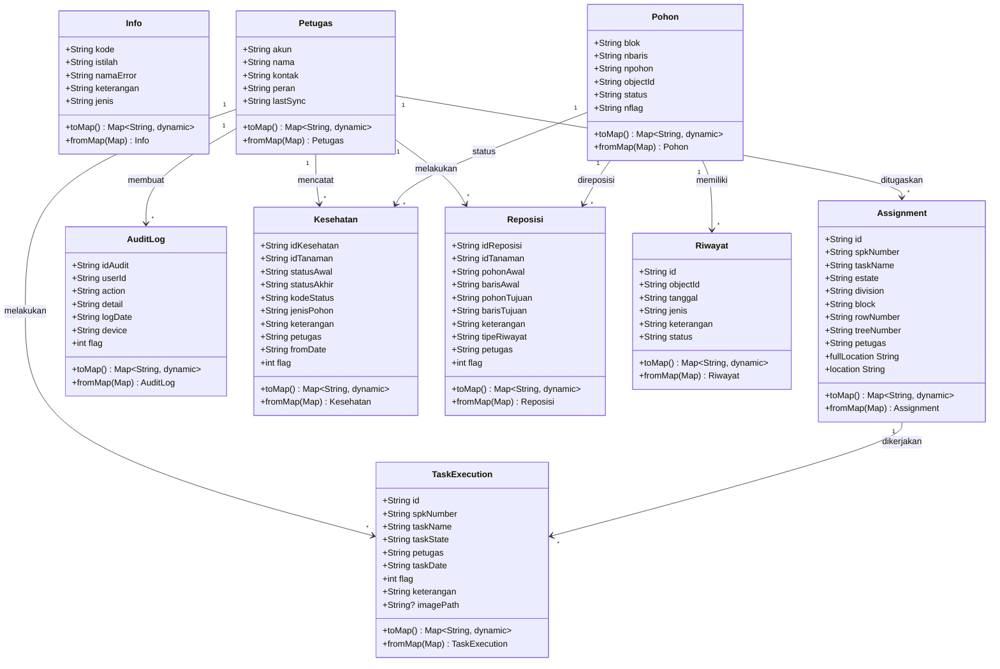
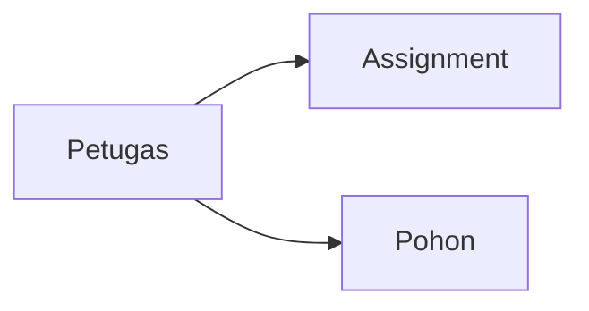
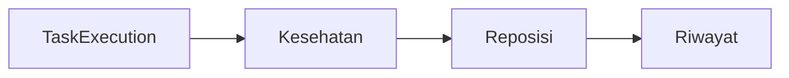
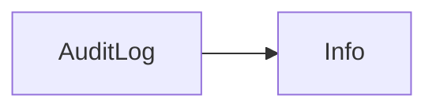
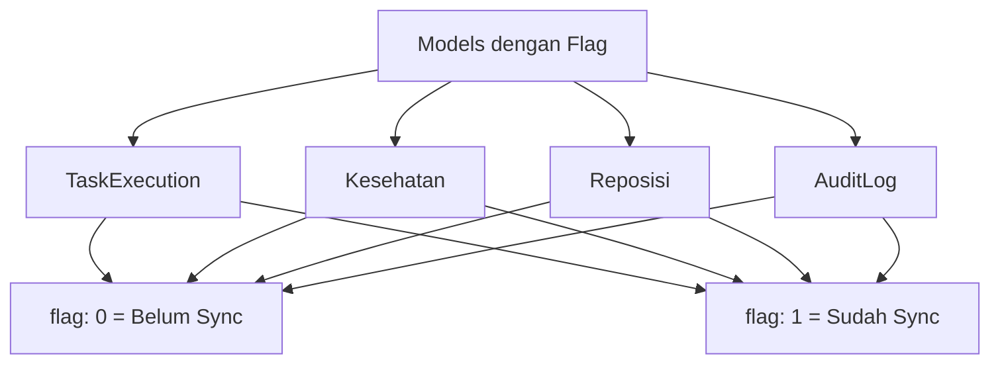

# Class Diagram - Model Classes

## 📊 Class Structure Diagram



## 📋 Penjelasan Relasi

### Petugas → Assignment (One to Many)
- Satu petugas dapat memiliki banyak assignment
- Property: `Assignment.petugas` → `Petugas.akun`

### Petugas → TaskExecution (One to Many)
- Satu petugas dapat melakukan banyak eksekusi tugas
- Property: `TaskExecution.petugas` → `Petugas.akun`

### Petugas → Kesehatan (One to Many)
- Satu petugas dapat mencatat banyak status kesehatan
- Property: `Kesehatan.petugas` → `Petugas.akun`

### Petugas → Reposisi (One to Many)
- Satu petugas dapat melakukan banyak reposisi
- Property: `Reposisi.petugas` → `Petugas.akun`

### Petugas → AuditLog (One to Many)
- Satu petugas dapat membuat banyak audit log
- Property: `AuditLog.userId` → `Petugas.akun`

### Pohon → Riwayat (One to Many)
- Satu pohon dapat memiliki banyak riwayat
- Property: `Riwayat.objectId` → `Pohon.objectId`

### Pohon → Kesehatan (One to Many)
- Satu pohon dapat memiliki banyak catatan kesehatan
- Property: `Kesehatan.idTanaman` → `Pohon.objectId`

### Pohon → Reposisi (One to Many)
- Satu pohon dapat direposisi berkali-kali
- Property: `Reposisi.idTanaman` → `Pohon.objectId`

### Assignment → TaskExecution (One to Many)
- Satu assignment dapat memiliki banyak eksekusi
- Property: `TaskExecution.spkNumber` → `Assignment.spkNumber`

---

## 🎯 Kategori Model

### Data Master (3 models)


### Data Operasional (4 models)


### Supporting Data (2 models)


---

## 🔄 Model dengan Flag Sinkronisasi



---

## 📊 Properties Count

| Model | Total Properties | Required | Nullable | Flag |
|-------|------------------|----------|----------|------|
| Assignment | 9 | 9 | 0 | ❌ |
| AuditLog | 7 | 7 | 0 | ✅ |
| TaskExecution | 9 | 8 | 1 | ✅ |
| Info | 5 | 5 | 0 | ❌ |
| Kesehatan | 10 | 10 | 0 | ✅ |
| Petugas | 5 | 5 | 0 | ❌ |
| Pohon | 6 | 6 | 0 | ❌ |
| Reposisi | 10 | 10 | 0 | ✅ |
| Riwayat | 6 | 6 | 0 | ❌ |

---

## 🏗️ Inheritance & Composition

Semua model classes **tidak menggunakan inheritance** (flat structure). Setiap model adalah independent class dengan:
- Properties sendiri
- Method `toMap()` untuk serialization
- Factory method `fromMap()` untuk deserialization

---

## 🔗 Database Table Mapping

| Model Class | Database Table | Primary Key |
|-------------|----------------|-------------|
| Assignment | assignment | id |
| AuditLog | auditlog | id_audit |
| TaskExecution | eksekusi | id |
| Info | - | - |
| Kesehatan | kesehatan | idKesehatan |
| Petugas | petugas | akun |
| Pohon | pohon | objectId |
| Reposisi | reposisi | idReposisi |
| Riwayat | riwayat | id |

**Note:** Model `Info` tidak memiliki tabel database dedicated (digunakan untuk error handling/info display)

---

## 📝 Common Methods

Semua model (kecuali helper functions di Pohon) memiliki 2 method standar:

### 1. toMap()
Konversi object ke Map untuk disimpan ke database

```dart
Map<String, dynamic> toMap() {
  return {
    'property1': value1,
    'property2': value2,
    // ...
  };
}
```

### 2. fromMap()
Factory method untuk membuat object dari Map (dari database)

```dart
factory ModelName.fromMap(Map<String, dynamic> map) {
  return ModelName(
    property1: map['property1'] ?? defaultValue,
    property2: map['property2'] ?? defaultValue,
    // ...
  );
}
```

---

## 🎨 Special Features

### Assignment
- Computed property `fullLocation`
- Computed property `location`

### Pohon
- Helper function `groupByBaris()`
- Helper function `generateDataGrid()`
- Helper function `generateHorizontalGrid()`
- Helper function `generateNumberAlignedGrid()`
- Const constructor untuk optimization

### TaskExecution
- Nullable property `imagePath`

---

## ⚠️ Important Notes

1. **No Foreign Key Constraints**: Relasi dijaga di application layer
2. **Immutability**: Semua properties menggunakan `final`
3. **Null Safety**: Default values di `fromMap()` untuk handle null
4. **Type Safety**: Semua properties memiliki type yang jelas
5. **Naming Convention**: camelCase di Dart, snake_case di database (untuk beberapa model)
