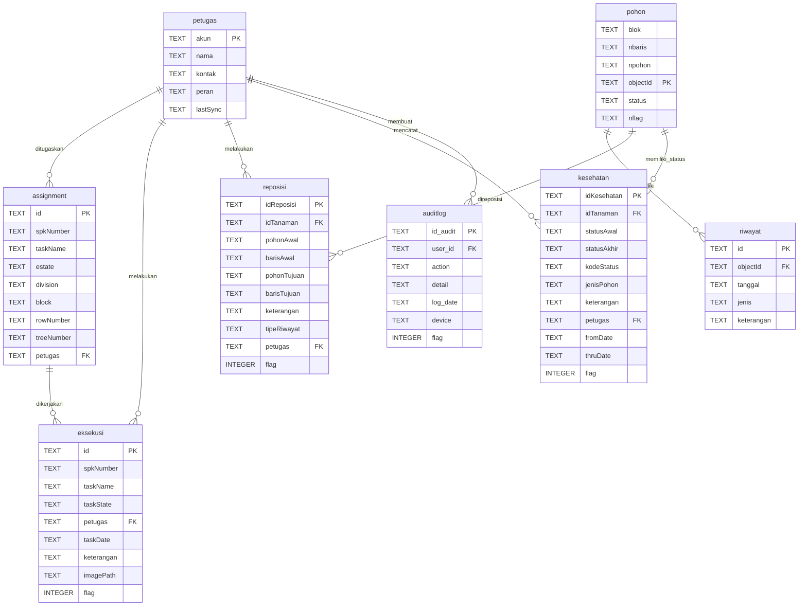

# ERD (Entity Relationship Diagram) - PlantDB Database

## 📊 Diagram Relasi Tabel

## 📋 Penjelasan Relasi

### 1. Petugas → Assignment (One to Many)
- Satu petugas dapat memiliki banyak assignment
- Relasi: `petugas.akun` → `assignment.petugas`

### 2. Petugas → Eksekusi (One to Many)
- Satu petugas dapat melakukan banyak eksekusi tugas
- Relasi: `petugas.akun` → `eksekusi.petugas`

### 3. Petugas → Reposisi (One to Many)
- Satu petugas dapat melakukan banyak reposisi pohon
- Relasi: `petugas.akun` → `reposisi.petugas`

### 4. Petugas → Kesehatan (One to Many)
- Satu petugas dapat mencatat banyak status kesehatan pohon
- Relasi: `petugas.akun` → `kesehatan.petugas`

### 5. Petugas → Auditlog (One to Many)
- Satu petugas dapat membuat banyak audit log
- Relasi: `petugas.akun` → `auditlog.user_id`

### 6. Pohon → Riwayat (One to Many)
- Satu pohon dapat memiliki banyak riwayat
- Relasi: `pohon.objectId` → `riwayat.objectId`

### 7. Pohon → Reposisi (One to Many)
- Satu pohon dapat direposisi berkali-kali
- Relasi: `pohon.objectId` → `reposisi.idTanaman`

### 8. Pohon → Kesehatan (One to Many)
- Satu pohon dapat memiliki banyak catatan kesehatan
- Relasi: `pohon.objectId` → `kesehatan.idTanaman`

### 9. Assignment → Eksekusi (One to Many)
- Satu assignment dapat memiliki banyak eksekusi
- Relasi: `assignment.spkNumber` → `eksekusi.spkNumber`

## 🎯 Kategori Tabel

### Data Master (3 tabel)
1. **petugas** - Data petugas lapangan
2. **pohon** - Data master pohon sawit
3. **assignment** - Data penugasan

### Data Operasional (4 tabel)
1. **eksekusi** - Pelaksanaan tugas
2. **riwayat** - Riwayat aktivitas pohon
3. **reposisi** - Perpindahan pohon
4. **kesehatan** - Status kesehatan pohon

### Audit & Logging (1 tabel)
1. **auditlog** - Log aktivitas user

## 🔄 Flag Sinkronisasi

Tabel dengan flag sinkronisasi (0 = belum sync, 1 = sudah sync):
- eksekusi
- reposisi
- kesehatan
- auditlog

## ⚠️ Catatan

- Database ini **tidak menggunakan foreign key constraint**
- Referential integrity dijaga di **application layer**
- Semua primary key menggunakan tipe **TEXT**
- Pastikan ID selalu unik untuk menghindari konflik
