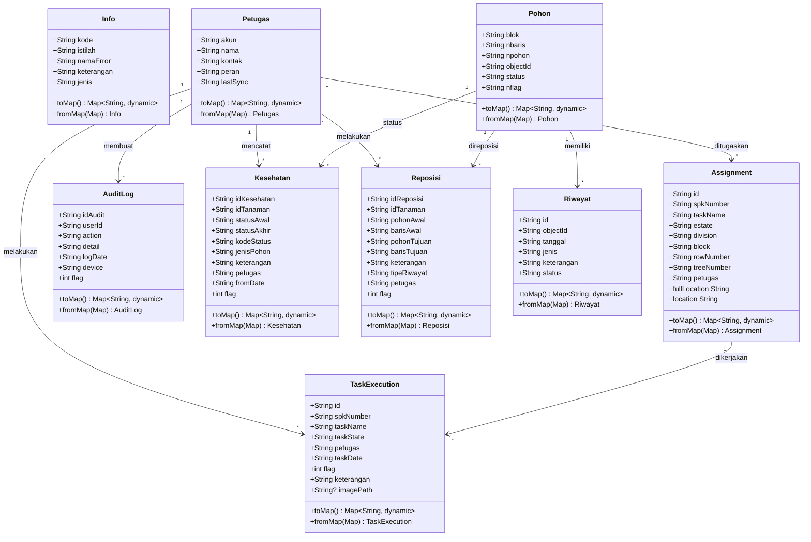
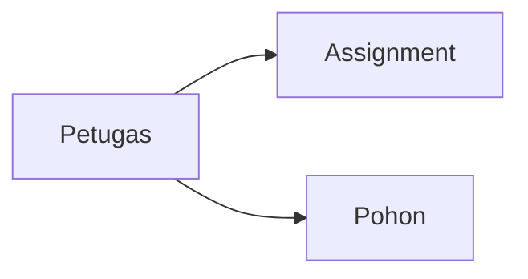
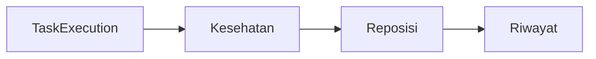
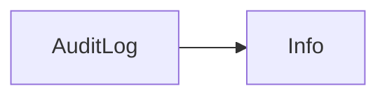
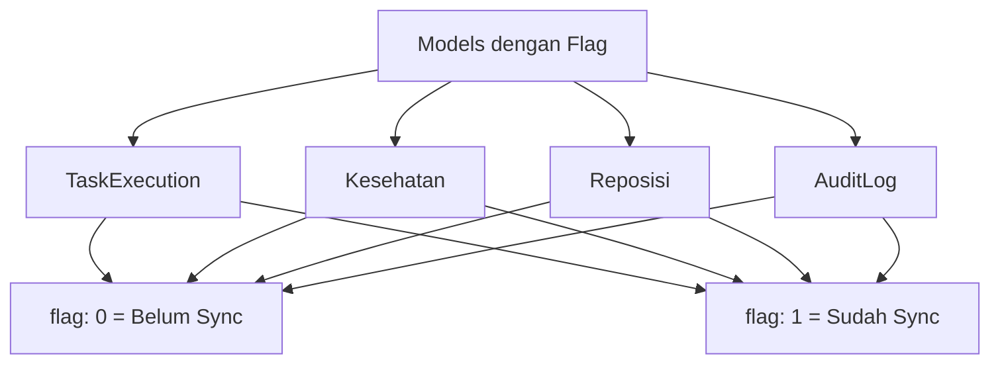
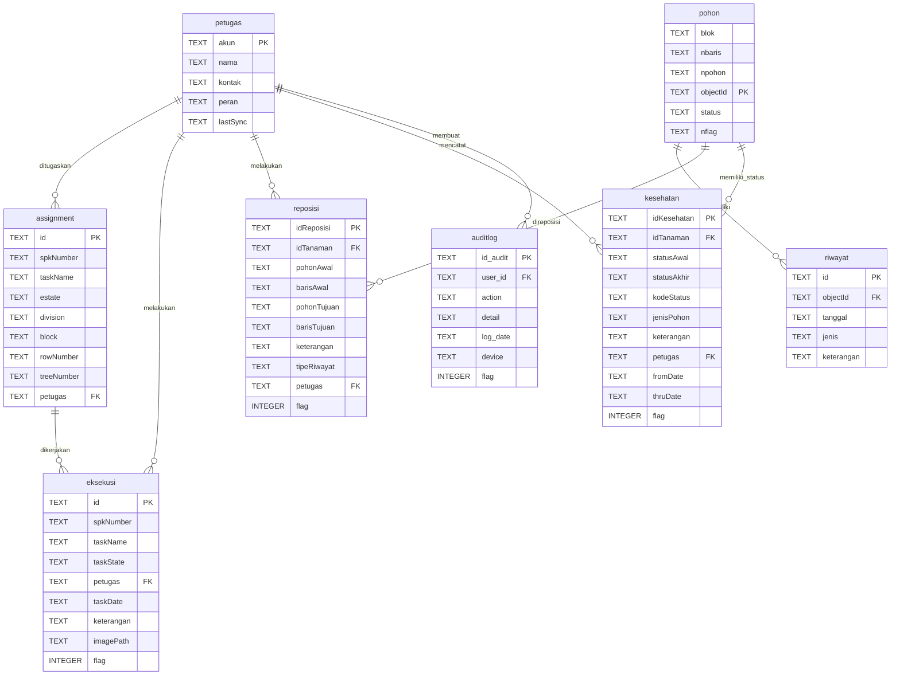

# Filename: ANDROID_9_CONFIG.md

# Konfigurasi Android 9 (Pie) - Project Perkebunan Sawit

## Ringkasan Perubahan

Project ini telah dikonfigurasi untuk mendukung Android 9 (API level 28 - Pie) sebagai versi minimum.

## Perubahan yang Dilakukan

### 1. **build.gradle.kts** (`android/app/build.gradle.kts`)
- **minSdk**: Diset ke `28` (Android 9 Pie)
- **targetSdk**: Diset ke `34` (Android 14)
- **compileSdk**: Diset ke `34`

### 2. **AndroidManifest.xml** (`android/app/src/main/AndroidManifest.xml`)
- Menambahkan permission `INTERNET`
- Menambahkan `android:networkSecurityConfig` untuk keamanan jaringan
- Menambahkan `android:usesCleartextTraffic="false"` untuk memblokir HTTP secara default

### 3. **Network Security Config** (`android/app/src/main/res/xml/network_security_config.xml`)
File baru yang mengatur kebijakan keamanan jaringan:
- Secara default hanya mengizinkan HTTPS
- Menyediakan opsi untuk mengizinkan HTTP pada domain tertentu (untuk development)

## Fitur Android 9 yang Perlu Diperhatikan

### 1. **Cleartext Traffic (HTTP)**
Android 9 secara default memblokir koneksi HTTP yang tidak terenkripsi. Jika aplikasi Anda perlu menggunakan HTTP:

**Untuk Development/Testing:**
Edit `network_security_config.xml` dan uncomment bagian `domain-config`:
```xml
<domain-config cleartextTrafficPermitted="true">
    <domain includeSubdomains="true">localhost</domain>
    <domain includeSubdomains="true">10.0.2.2</domain>
    <domain includeSubdomains="true">your-api-domain.com</domain>
</domain-config>
```

**Untuk Production:**
Gunakan HTTPS untuk semua koneksi jaringan (recommended).

### 2. **Notch/Display Cutout Support**
Android 9 memperkenalkan dukungan untuk layar dengan notch. Jika diperlukan, tambahkan:
```xml
<meta-data
    android:name="android.max_aspect"
    android:value="2.1" />
```

### 3. **Power Management**
Android 9 memiliki pembatasan background yang lebih ketat. Pastikan:
- Gunakan WorkManager untuk background tasks
- Implementasikan foreground services dengan benar jika diperlukan

### 4. **Privacy Changes**
- Akses ke sensor dibatasi saat aplikasi di background
- Build serial number memerlukan permission khusus
- MAC address tidak bisa diakses langsung

## Testing

### Menjalankan di Emulator Android 9:
1. Buka Android Studio
2. AVD Manager → Create Virtual Device
3. Pilih device dan system image **Pie (API 28)**
4. Jalankan: `flutter run`

### Menjalankan di Device Fisik:
Pastikan device Anda menjalankan Android 9 atau lebih tinggi.

## Build APK/AAB

```bash
# Debug APK
flutter build apk --debug

# Release APK
flutter build apk --release

# Android App Bundle (untuk Google Play)
flutter build appbundle --release
```

## Troubleshooting

### Error: "Cleartext HTTP traffic not permitted"
**Solusi:** Edit `network_security_config.xml` dan izinkan domain yang diperlukan, atau gunakan HTTPS.

### Error: "Installation failed with message INSTALL_FAILED_OLDER_SDK"
**Solusi:** Pastikan device/emulator Anda menjalankan Android 9 (API 28) atau lebih tinggi.

### Error: "Execution failed for task ':app:processDebugManifest'"
**Solusi:** Clean dan rebuild project:
```bash
flutter clean
flutter pub get
flutter build apk
```

## Kompatibilitas

- **Minimum**: Android 9 (API 28) - Pie
- **Target**: Android 14 (API 34)
- **Tested on**: Android 9, 10, 11, 12, 13, 14

## Referensi

- [Android 9 Behavior Changes](https://developer.android.com/about/versions/pie/android-9.0-changes-all)
- [Network Security Configuration](https://developer.android.com/training/articles/security-config)
- [Flutter Android Setup](https://docs.flutter.dev/deployment/android)

---
**Terakhir diupdate:** 12 Desember 2025


---

# Filename: README.md

# flutter_project

Aplikasi Perkebunan Sawit

## Getting Started

This project is a starting point for a Flutter application.

A few resources to get you started if this is your first Flutter project:

- [Lab: Write your first Flutter app](https://docs.flutter.dev/get-started/codelab)
- [Cookbook: Useful Flutter samples](https://docs.flutter.dev/cookbook)

For help getting started with Flutter development, view the
[online documentation](https://docs.flutter.dev/), which offers tutorials,
samples, guidance on mobile development, and a full API reference.


---

# Filename: lib/01_README.md

# Struktur Folder Lib

Proyek ini menggunakan arsitektur MVC (Model-View-Controller) dengan struktur folder sebagai berikut:

## 📁 Struktur Folder

```
lib/
├── main.dart                 # Entry point aplikasi
├── mvc_dao/                  # Data Access Objects
├── mvc_libs/                 # Libraries & Utilities
├── mvc_models/               # Data Models
├── mvc_services/             # Business Logic Services
├── plantdb/                  # Database Plant/Template Files
└── screens/                  # UI Screens/Pages
```

## 📝 Deskripsi Folder

### 1. `mvc_dao/` - Data Access Objects
Berisi class-class untuk mengakses database (SQLite) dan operasi CRUD:
- Database helper
- DAO (Data Access Object) untuk setiap tabel
- Query builder dan database utilities

### 2. `mvc_libs/` - Libraries & Utilities
Berisi helper functions, utilities, dan library custom:
- String helpers
- Date/time utilities
- Validation helpers
- Constants
- Custom widgets yang reusable

### 3. `mvc_models/` - Data Models
Berisi class model untuk representasi data:
- Entity models (sesuai dengan tabel database)
- DTO (Data Transfer Objects)
- Response models untuk API

### 4. `mvc_services/` - Business Logic Services
Berisi business logic dan services:
- Service layer untuk komunikasi dengan backend
- Business rules dan validations
- State management
- API integration

### 5. `plantdb/` - Database Plant/Template Files
Berisi file-file template database:
- SQL scripts untuk inisialisasi database
- Seed data
- Database migration files
- Database schema definitions

### 6. `screens/` - UI Screens/Pages
Berisi halaman-halaman UI aplikasi:
- Home screen
- Form screens
- List screens
- Detail screens
- Settings screens

## 🏗️ Arsitektur

Proyek ini menggunakan pola **MVC (Model-View-Controller)**:

- **Model** (`mvc_models/`): Representasi data dan struktur
- **View** (`screens/`): User Interface dan presentasi
- **Controller** (`mvc_services/`): Business logic dan koordinasi
- **DAO** (`mvc_dao/`): Data persistence layer
- **Libs** (`mvc_libs/`): Shared utilities dan helpers

## 📦 Dependencies Utama

- `sqflite`: Database SQLite lokal
- `http`: HTTP requests
- `image_picker`: Image selection
- `permission_handler`: Permission management
- `device_info_plus`: Device information
- `connectivity_plus`: Network connectivity
- `intl`: Internationalization

## 🎯 Best Practices

1. **Separation of Concerns**: Setiap folder memiliki tanggung jawab yang jelas
2. **Reusability**: Code yang reusable ditempatkan di `mvc_libs/`
3. **Maintainability**: Struktur yang terorganisir memudahkan maintenance
4. **Scalability**: Mudah untuk menambahkan fitur baru


---

# Filename: lib/screens/02_README.md

# Dokumentasi Layar (Screens)

Direktori ini berisi layar antarmuka pengguna (UI) aplikasi. Setiap file sesuai dengan layar atau halaman tertentu dalam alur aplikasi.

## Deskripsi File

| Nama File | Deskripsi |
|---|---|
| `scr_assignment_content.dart` | **Layar Detail Tugas**: Menampilkan detail tugas tertentu (SPK). Memungkinkan pengguna melihat informasi tugas dan memilih untuk "Menyelesaikan" atau "Menunda" tugas tersebut. |
| `scr_assignment_list.dart` | **Layar Daftar Tugas**: Menampilkan daftar semua tugas yang diberikan kepada pengguna. Mengambil data dari database SQLite lokal dan menyediakan navigasi ke detail tugas. |
| `scr_execution_form.dart` | **Layar Formulir Eksekusi**: Formulir yang digunakan saat menyelesaikan atau menunda tugas. Mengharuskan pengguna memasukkan catatan dan mengambil foto sebagai bukti kerja sebelum menyimpan status ke database lokal. |
| `scr_initial_sync.dart` | **Layar Sinkronisasi Awal**: Layar yang ditampilkan setelah login untuk melakukan sinkronisasi data awal. Mengunduh SPK (tugas), riwayat Kesehatan Tanaman, dan data Tanaman dari server ke perangkat lokal. |
| `scr_login.dart` | **Layar Login**: Titik masuk aplikasi. Menyediakan antarmuka pengguna untuk login, menampilkan animasi dan latar belakang gradien. |
| `scr_plant_health.dart` | **Layar Kesehatan Tanaman**: Layar untuk memantau kesehatan tanaman. Memvisualisasikan pohon dalam tata letak kisi heksagonal, memungkinkan pengguna memilih pohon dan memperbarui status kesehatannya. |
| `scr_plant_reposition.dart` | **Layar Reposisi Tanaman**: Mirip dengan layar Kesehatan Tanaman, layar ini memungkinkan pengguna mengelola reposisi tanaman (sensus) menggunakan visualisasi kisi heksagonal. |
| `scr_sync_action.dart` | **Layar Aksi Sinkronisasi**: Pusat sinkronisasi utama untuk mengunggah data lokal ke server. Menangani pengunggahan batch Eksekusi Tugas, Kesehatan Tanaman, Reposisi, dan Log Audit. |

## Subdirektori

### `sync/`
Berisi kelas pembantu dan widget khusus untuk layar `scr_sync_action.dart`.
- `sync_models.dart`: Model data untuk batch sinkronisasi.
- `sync_service.dart`: Logika layanan untuk mengambil data dari SQLite dan mengirimkannya ke server.
- `sync_widgets.dart`: Komponen UI yang digunakan di layar sinkronisasi (misalnya, bilah progres, kartu status).

### `widgets/`
Berisi komponen UI yang dapat digunakan kembali di berbagai layar untuk menjaga konsistensi dan mengurangi duplikasi kode.
- `w_assigment_detail.dart`: Widget untuk tampilan detail tugas.
- `w_general.dart`: Widget tujuan umum (tombol, gaya teks, bilah aplikasi).
- `w_login.dart`: Widget khusus untuk layar login.
- `w_plant_health.dart`: Widget untuk layar kesehatan tanaman.
- `w_popup_action.dart`: Dialog popup untuk tindakan tugas.
- `w_popup_health.dart`: Dialog popup untuk pembaruan kesehatan.
- `w_popup_reposition.dart`: Dialog popup untuk pembaruan reposisi.
- `w_reposition.dart`: Widget untuk layar reposisi.
- `w_task_exec.dart`: Widget terkait tampilan eksekusi tugas.


---

# Filename: lib/mvc_dao/QUICK_REF_DAO.md

# Quick Reference - DAO Classes

## 🚀 Quick Start

```dart
import 'package:flutter_project/mvc_dao/dao_assignment.dart';
import 'package:flutter_project/mvc_dao/dao_audit_log.dart';
import 'package:flutter_project/mvc_dao/dao_kesehatan.dart';
import 'package:flutter_project/mvc_dao/dao_petugas.dart';
import 'package:flutter_project/mvc_dao/dao_pohon.dart';
import 'package:flutter_project/mvc_dao/dao_reposisi.dart';
import 'package:flutter_project/mvc_dao/dao_riwayat.dart';
import 'package:flutter_project/mvc_dao/dao_task_execution.dart';
import 'package:flutter_project/mvc_dao/dao_manager.dart';
```

---

## 📊 DAO Summary

| DAO | Table | Model | Flag | Methods |
|-----|-------|-------|------|---------|
| AssignmentDao | assignment | Assignment | ❌ | 8 |
| AuditLogDao | auditlog | AuditLog | ✅ | 6 |
| KesehatanDao | kesehatan | Kesehatan | ✅ | 9 |
| PetugasDao | petugas | Petugas | ❌ | 5 |
| PohonDao | pohon | Pohon | ❌ | 6 |
| ReposisiDao | reposisi | Reposisi | ✅ | 7 |
| RiwayatDao | riwayat | Riwayat | ❌ | 4 |
| TaskExecutionDao | eksekusi | TaskExecution | ✅ | 9 |
| DaoManager | All | Generic | - | 20+ |

---

## 💾 CRUD Operations

### Insert Single
```dart
final dao = PohonDao();
await dao.insertPohon(pohon);
```

### Insert Batch (Efficient)
```dart
await dao.insertPohonBatch(pohonList);
```

### Get All
```dart
final list = await dao.getAllPohon();
```

### Get By ID
```dart
final pohon = await dao.getPohonById('POH-001');
```

### Update
```dart
await dao.updatePohon(updatedPohon);
```

### Delete
```dart
await dao.deletePohon('POH-001');
```

### Delete All
```dart
await dao.deleteAllPohon();
```

---

## 🔄 Flag Sync Operations

### Get Unsynced Data
```dart
final unsynced = await dao.getAllByFlag(); // flag = 0
```

### Update Flag After Sync
```dart
await dao.updateFlag(id); // set flag = 1
```

### Sync Pattern
```dart
// 1. Get unsynced
final unsynced = await dao.getAllByFlag();

// 2. Sync to server
for (var item in unsynced) {
  await api.sync(item);
  
  // 3. Update flag
  await dao.updateFlag(item.id);
}
```

---

## 🎯 Common Patterns

### Batch Insert (Best Performance)
```dart
// ✅ GOOD - Batch
await dao.insertPohonBatch(pohonList);

// ❌ BAD - Loop
for (var pohon in pohonList) {
  await dao.insertPohon(pohon);
}
```

### Upsert (Insert or Update)
```dart
// ConflictAlgorithm.replace = upsert
await dao.insertPohon(pohon); // auto insert or update
```

### Transaction
```dart
final db = await DBHelper().database;
await db.transaction((txn) async {
  await txn.insert('pohon', pohon1.toMap());
  await txn.insert('pohon', pohon2.toMap());
});
```

---

## 📝 Specific DAO Examples

### AssignmentDao
```dart
final dao = AssignmentDao();

// Batch insert
await dao.insertAssignmentsBatch(assignments);

// Get by ID
final assignment = await dao.getAssignmentById('ASG-001');
```

### AuditLogDao
```dart
final dao = AuditLogDao();

// Create log (auto device info)
await dao.createLog('INSERT', '{"table":"pohon"}');

// Get unsynced
final logs = await dao.getAllByFlag();
```

### PetugasDao
```dart
final dao = PetugasDao();

// Get current petugas
final petugas = await dao.getPetugas();

// Update last sync
await dao.updateLastSync(
  'PTG-001',
  DateTime.now().toString(),
);
```

### RiwayatDao
```dart
final dao = RiwayatDao();

// Get riwayat by pohon
final riwayat = await dao.getRiwayatByObjectId('POH-001');
```

### DaoManager
```dart
final manager = DaoManager();

// Get all tables
final tables = await manager.getAllTableNames();

// Count records
final count = await manager.countRecords('pohon');

// Query with pagination
final data = await manager.queryTablePaginated(
  'pohon',
  limit: 20,
  offset: 0,
);
```

---

## 🔧 Error Handling

```dart
try {
  await dao.insertPohon(pohon);
} catch (e) {
  print('Error: $e');
  // Handle error
}
```

---

## ⚡ Performance Tips

| Tip | Description |
|-----|-------------|
| **Batch Insert** | Use batch for > 10 records |
| **Transaction** | Use for multiple operations |
| **Pagination** | Use limit/offset for large data |
| **Index** | Ensure PK/FK are indexed |

---

## 📋 Method Naming Conventions

| Pattern | Example | Description |
|---------|---------|-------------|
| `insert*()` | `insertPohon()` | Insert single |
| `insert*Batch()` | `insertPohonBatch()` | Insert batch |
| `getAll*()` | `getAllPohon()` | Get all records |
| `get*ById()` | `getPohonById()` | Get by primary key |
| `getAllByFlag()` | `getAllByFlag()` | Get unsynced (flag=0) |
| `update*()` | `updatePohon()` | Update record |
| `updateFlag()` | `updateFlag()` | Set flag = 1 |
| `delete*()` | `deletePohon()` | Delete by ID |
| `deleteAll*()` | `deleteAllPohon()` | Delete all |

---

## 🔗 Quick Links

- [Full Documentation](README_DAO)
- [Database Documentation](../plantdb/README_db_helper.md)
- [Models Documentation](../mvc_models/03_README_models)

---

## ⚠️ Important Notes

✅ **DO:**
- Use batch for bulk operations
- Update flag after successful sync
- Use try-catch for error handling
- Use ConflictAlgorithm.replace for upsert

❌ **DON'T:**
- Don't use loop for many inserts
- Don't forget to update flag
- Don't hardcode table names
- Don't forget null checks


---

# Filename: lib/mvc_dao/README_DAO.md

# Dokumentasi DAO Classes - Data Access Objects

## 📋 Overview

Folder `mvc_dao` berisi **9 DAO (Data Access Object) classes** yang mengelola akses ke database SQLite. Setiap DAO class bertanggung jawab untuk operasi CRUD (Create, Read, Update, Delete) pada tabel tertentu.

**Pattern:** Data Access Object (DAO) Pattern  
**Database:** SQLite via `sqflite` package  
**Database Helper:** `DBHelper` (Singleton)

---

## 📊 Daftar DAO Classes

| No | DAO Class | File | Table | Model | Methods |
|----|-----------|------|-------|-------|---------|
| 1 | `AssignmentDao` | dao_assignment.dart | assignment | Assignment | 8 methods |
| 2 | `AuditLogDao` | dao_audit_log.dart | auditlog | AuditLog | 6 methods |
| 3 | `KesehatanDao` | dao_kesehatan.dart | kesehatan | Kesehatan | 9 methods |
| 4 | `PetugasDao` | dao_petugas.dart | petugas | Petugas | 5 methods |
| 5 | `PohonDao` | dao_pohon.dart | pohon | Pohon | 6 methods |
| 6 | `ReposisiDao` | dao_reposisi.dart | reposisi | Reposisi | 7 methods |
| 7 | `RiwayatDao` | dao_riwayat.dart | riwayat | Riwayat | 4 methods |
| 8 | `TaskExecutionDao` | dao_task_execution.dart | eksekusi | TaskExecution | 9 methods |
| 9 | `DaoManager` | dao_manager.dart | All tables | Generic | 20+ methods |

---

## 1️⃣ AssignmentDao

**File:** `dao_assignment.dart`  
**Table:** `assignment`  
**Model:** `Assignment`

### Methods

| Method | Return Type | Description |
|--------|-------------|-------------|
| `insertAssignment()` | `Future<int>` | Insert single assignment |
| `insertListAssignment()` | `Future<int>` | Insert list (loop) |
| `insertAssignmentsBatch()` | `Future<int>` | Insert list (batch) |
| `getAllAssignment()` | `Future<List<Assignment>>` | Get all assignments |
| `getAssignmentById()` | `Future<Assignment?>` | Get by ID |
| `updateAssignment()` | `Future<int>` | Update assignment |
| `deleteAssignment()` | `Future<int>` | Delete by ID |
| `deleteAllAssignments()` | `Future<int>` | Delete all |

### Contoh Penggunaan

```dart
final dao = AssignmentDao();

// Insert single
await dao.insertAssignment(assignment);

// Insert batch (lebih efisien untuk banyak data)
await dao.insertAssignmentsBatch(assignmentList);

// Get all
final assignments = await dao.getAllAssignment();

// Get by ID
final assignment = await dao.getAssignmentById('ASG-001');

// Update
await dao.updateAssignment(updatedAssignment);

// Delete
await dao.deleteAssignment('ASG-001');

// Delete all
await dao.deleteAllAssignments();
```

---

## 2️⃣ AuditLogDao

**File:** `dao_audit_log.dart`  
**Table:** `auditlog`  
**Model:** `AuditLog`

### Methods

| Method | Return Type | Description |
|--------|-------------|-------------|
| `insertAuditLog()` | `Future<int>` | Insert audit log |
| `getAllAuditLog()` | `Future<List<AuditLog>>` | Get all logs |
| `getAllByFlag()` | `Future<List<AuditLog>>` | Get unsynced logs (flag=0) |
| `updateFlag()` | `Future<void>` | Update flag to 1 |
| `createLog()` | `Future<void>` | Create log with auto device info |
| `getDeviceName()` | `Future<String>` | Get device name (Android/iOS) |

### Special Features

- **Auto Device Info**: Method `createLog()` otomatis mendapatkan device name
- **UUID Generation**: Menggunakan `Uuid().v4()` untuk generate ID
- **Platform Detection**: Deteksi Android/iOS untuk device info

### Contoh Penggunaan

```dart
final dao = AuditLogDao();

// Create log (simple)
await dao.createLog('INSERT', '{"table":"eksekusi","id":"EKS-001"}');

// Get unsynced logs
final unsyncedLogs = await dao.getAllByFlag();

// Update flag after sync
for (var log in unsyncedLogs) {
  await dao.updateFlag(log.idAudit);
}
```

---

## 3️⃣ KesehatanDao

**File:** `dao_kesehatan.dart`  
**Table:** `kesehatan`  
**Model:** `Kesehatan`

### Methods

| Method | Return Type | Description |
|--------|-------------|-------------|
| `insertKesehatan()` | `Future<int>` | Insert single |
| `insertListKesehatan()` | `Future<int>` | Insert list (loop) |
| `insertKesehatanBatch()` | `Future<int>` | Insert list (batch) |
| `getAllKesehatan()` | `Future<List<Kesehatan>>` | Get all |
| `getAllByFlag()` | `Future<List<Kesehatan>>` | Get unsynced (flag=0) |
| `getKesehatanById()` | `Future<Kesehatan?>` | Get by ID |
| `updateKesehatan()` | `Future<int>` | Update |
| `updateFlag()` | `Future<void>` | Update flag to 1 |
| `deleteKesehatan()` | `Future<int>` | Delete by ID |
| `deleteAllAssignments()` | `Future<int>` | Delete all |

### Contoh Penggunaan

```dart
final dao = KesehatanDao();

// Insert batch
await dao.insertKesehatanBatch(kesehatanList);

// Get unsynced
final unsynced = await dao.getAllByFlag();

// Update flag
await dao.updateFlag('KES-001');
```

---

## 4️⃣ PetugasDao

**File:** `dao_petugas.dart`  
**Table:** `petugas`  
**Model:** `Petugas`

### Methods

| Method | Return Type | Description |
|--------|-------------|-------------|
| `insertPetugas()` | `Future<int>` | Insert/update petugas |
| `getAllPetugas()` | `Future<List<Petugas>>` | Get all |
| `getByAkun()` | `Future<Petugas?>` | Get by akun (PK) |
| `getPetugas()` | `Future<Petugas?>` | Get first petugas |
| `updateLastSync()` | `Future<int>` | Update last sync time |
| `deleteAllWorkers()` | `Future<int>` | Delete all |

### Contoh Penggunaan

```dart
final dao = PetugasDao();

// Insert/update
await dao.insertPetugas(petugas);

// Get current petugas
final petugas = await dao.getPetugas();

// Update last sync
await dao.updateLastSync('PTG-001', DateTime.now().toString());
```

---

## 5️⃣ PohonDao

**File:** `dao_pohon.dart`  
**Table:** `pohon`  
**Model:** `Pohon`

### Methods

| Method | Return Type | Description |
|--------|-------------|-------------|
| `insertPohon()` | `Future<int>` | Insert single |
| `insertPohonBatch()` | `Future<int>` | Insert list (batch) |
| `getAllPohon()` | `Future<List<Pohon>>` | Get all |
| `getPohonById()` | `Future<Pohon?>` | Get by objectId |
| `updatePohon()` | `Future<int>` | Update |
| `deletePohon()` | `Future<int>` | Delete by objectId |
| `deleteAllPohon()` | `Future<int>` | Delete all |

### Contoh Penggunaan

```dart
final dao = PohonDao();

// Insert batch (efisien untuk banyak data)
await dao.insertPohonBatch(pohonList);

// Get all
final pohonList = await dao.getAllPohon();

// Get by ID
final pohon = await dao.getPohonById('POH-A1-05-123');
```

---

## 6️⃣ ReposisiDao

**File:** `dao_reposisi.dart`  
**Table:** `reposisi`  
**Model:** `Reposisi`

### Methods

| Method | Return Type | Description |
|--------|-------------|-------------|
| `insertReposisi()` | `Future<int>` | Insert reposisi |
| `getAllReposisi()` | `Future<List<Reposisi>>` | Get all |
| `getAllByFlag()` | `Future<List<Reposisi>>` | Get unsynced (flag=0) |
| `getByIdReposisi()` | `Future<Reposisi?>` | Get by ID |
| `getByIdTanaman()` | `Future<List<Reposisi>>` | Get by pohon ID |
| `updateReposisi()` | `Future<int>` | Update |
| `updateFlag()` | `Future<void>` | Update flag to 1 |
| `deleteAll()` | `Future<int>` | Delete all |

### Contoh Penggunaan

```dart
final dao = ReposisiDao();

// Insert
await dao.insertReposisi(reposisi);

// Get by pohon
final riwayatReposisi = await dao.getByIdTanaman('POH-A1-05-123');

// Get unsynced
final unsynced = await dao.getAllByFlag();

// Update flag
await dao.updateFlag('REP-001');
```

---

## 7️⃣ RiwayatDao

**File:** `dao_riwayat.dart`  
**Table:** `riwayat`  
**Model:** `Riwayat`

### Methods

| Method | Return Type | Description |
|--------|-------------|-------------|
| `insertRiwayat()` | `Future<int>` | Insert riwayat |
| `getAllRiwayat()` | `Future<List<Riwayat>>` | Get all |
| `getRiwayatByObjectId()` | `Future<List<Riwayat>>` | Get by pohon ID |
| `updateRiwayat()` | `Future<int>` | Update |
| `deleteRiwayat()` | `Future<int>` | Delete by ID |

### Contoh Penggunaan

```dart
final dao = RiwayatDao();

// Insert
await dao.insertRiwayat(riwayat);

// Get riwayat pohon
final riwayatPohon = await dao.getRiwayatByObjectId('POH-A1-05-123');

// Update
await dao.updateRiwayat(updatedRiwayat);
```

---

## 8️⃣ TaskExecutionDao

**File:** `dao_task_execution.dart`  
**Table:** `eksekusi`  
**Model:** `TaskExecution`

### Methods

| Method | Return Type | Description |
|--------|-------------|-------------|
| `insertTaskExec()` | `Future<int>` | Insert single |
| `insertListTaskExec()` | `Future<int>` | Insert list (loop) |
| `inserttaskExecBatch()` | `Future<int>` | Insert list (batch) |
| `getAllTaskExec()` | `Future<List<TaskExecution>>` | Get all |
| `getAllTaskExecByFlag()` | `Future<List<TaskExecution>>` | Get unsynced (flag=0) |
| `getTaskExecById()` | `Future<TaskExecution?>` | Get by ID |
| `updateAssignment()` | `Future<int>` | Update (typo: should be updateTaskExec) |
| `updateFlag()` | `Future<void>` | Update flag to 1 |
| `deleteTaskExec()` | `Future<int>` | Delete by ID |
| `deleteAllTaskExec()` | `Future<int>` | Delete all |

### Contoh Penggunaan

```dart
final dao = TaskExecutionDao();

// Insert batch
await dao.inserttaskExecBatch(taskExecList);

// Get unsynced
final unsynced = await dao.getAllTaskExecByFlag();

// Update flag
await dao.updateFlag('EKS-001');
```

---

## 9️⃣ DaoManager

**File:** `dao_manager.dart`  
**Table:** All tables (generic)  
**Pattern:** Singleton + Generic DAO

### Methods (20+ methods)

#### Table Information
- `getAllTableNames()` - Get all table names
- `tableExists()` - Check if table exists
- `getTableSchema()` - Get table structure
- `countRecords()` - Count rows in table

#### Query Operations
- `queryTable()` - Query all data
- `queryTableWhere()` - Query with WHERE
- `queryTablePaginated()` - Query with pagination
- `rawQuery()` - Execute raw SQL query

#### CRUD Operations
- `insertRecord()` - Insert data
- `updateRecord()` - Update by ID
- `updateRecordWhere()` - Update with WHERE
- `deleteRecord()` - Delete by ID
- `deleteRecordWhere()` - Delete with WHERE
- `deleteAllRecords()` - Delete all from table

#### Advanced Operations
- `batch()` - Batch operations
- `transaction()` - Transaction
- `rawExecute()` - Execute raw SQL

### Contoh Penggunaan

```dart
final manager = DaoManager();

// Get all tables
final tables = await manager.getAllTableNames();

// Count records
final count = await manager.countRecords('pohon');

// Query with pagination
final data = await manager.queryTablePaginated(
  'pohon',
  limit: 20,
  offset: 0,
  orderBy: 'blok ASC',
);

// Batch operations
await manager.batch([
  DatabaseOperation(
    table: 'pohon',
    type: OperationType.insert,
    data: pohon1.toMap(),
  ),
  DatabaseOperation(
    table: 'pohon',
    type: OperationType.insert,
    data: pohon2.toMap(),
  ),
]);
```

---

## 🎯 Common Patterns

### 1. Batch Insert (Efisien untuk Banyak Data)

```dart
// ❌ TIDAK EFISIEN (loop)
for (var item in items) {
  await dao.insert(item);
}

// ✅ EFISIEN (batch)
await dao.insertBatch(items);
```

### 2. Flag Sync Pattern

```dart
// Get unsynced data
final unsynced = await dao.getAllByFlag();

// Sync to server
for (var item in unsynced) {
  await api.sync(item);
  // Update flag after success
  await dao.updateFlag(item.id);
}
```

### 3. ConflictAlgorithm.replace

Semua DAO menggunakan `ConflictAlgorithm.replace`:
- Jika data sudah ada (PK sama) → UPDATE
- Jika data belum ada → INSERT

```dart
await db.insert(
  'table',
  data.toMap(),
  conflictAlgorithm: ConflictAlgorithm.replace,
);
```

---

## 📋 Import Statements

Semua DAO menggunakan **relative imports**:

```dart
import '../plantdb/db_helper.dart';        // Database helper
import '../mvc_models/model_name.dart';    // Model class
import 'package:sqflite/sqflite.dart';     // SQLite package
```

---

## 🔄 DAO dengan Flag Sinkronisasi

4 DAO memiliki method `getAllByFlag()` dan `updateFlag()`:

| DAO | Table | Flag Column |
|-----|-------|-------------|
| AuditLogDao | auditlog | flag |
| KesehatanDao | kesehatan | flag |
| ReposisiDao | reposisi | flag |
| TaskExecutionDao | eksekusi | flag |

---

## ⚠️ Best Practices

### ✅ DO:
- Gunakan **batch insert** untuk banyak data
- Gunakan `ConflictAlgorithm.replace` untuk upsert
- Update flag setelah sync berhasil
- Gunakan transaction untuk multiple operations
- Handle null dengan `?` operator

### ❌ DON'T:
- Jangan gunakan loop untuk insert banyak data
- Jangan lupa update flag setelah sync
- Jangan hardcode table names (gunakan constant)
- Jangan lupa handle error dengan try-catch

---

## 🔧 Error Handling

```dart
try {
  await dao.insertPohon(pohon);
} catch (e) {
  print('Error inserting pohon: $e');
  // Handle error
}
```

---

## 📊 Performance Tips

1. **Batch Operations**: Gunakan batch untuk insert/update banyak data
2. **Indexing**: Pastikan primary key dan foreign key ter-index
3. **Pagination**: Gunakan limit/offset untuk data besar
4. **Transaction**: Gunakan transaction untuk operasi multiple
5. **Close Connection**: Database connection di-manage oleh DBHelper (singleton)

---

## 🔗 Relasi dengan Components Lain

```
DAO Layer
    ↓
DBHelper (Singleton)
    ↓
SQLite Database (plantdb.db)

DAO Layer
    ↑
Service Layer (mvc_services)
    ↑
UI Layer (screens)
```

---

## 📞 Support

Untuk pertanyaan atau issue terkait DAO classes, silakan hubungi tim development.

**Last Updated:** 2024-12-12  
**Total DAO Classes:** 9 classes  
**Database:** SQLite (plantdb.db)  
**Minimum Android SDK:** 28 (Android 9 - Pie)


---

# Filename: lib/mvc_libs/LIBS_QUICK_REF.md

# Quick Reference - MVC Libs

## 🚀 ConnectionUtils

Utility untuk koneksi dan error handling.

### Import
```dart
import 'package:kebun/mvc_libs/connection_utils.dart';
```

### Cek Koneksi Internet
```dart
if (await ConnectionUtils.checkConnection()) {
  print("Online 🟢");
} else {
  print("Offline 🔴");
}
```

### Handle Error Message
```dart
try {
  // ... code that might throw error
} catch (e) {
  final utils = ConnectionUtils();
  
  // 1. Parse SQL Error
  String msg = utils.parseSqlError(e.toString());
  
  // 2. Get Friendly Message from Code
  String statusMsg = utils.handleErrorStatus("404");
}
```

### Common Error Codes
| Code | Meaning |
|------|---------|
| 401 | Unauthorized (Login ulang) |
| 404 | Not Found |
| 408 | Timeout |
| 409 | Conflict (Duplicate) |
| 500 | Server Error |


---

# Filename: lib/mvc_libs/README_libs.md

# Dokumentasi MVC Libs

## 📋 Overview

Folder `mvc_libs` berisi library dan utility classes yang digunakan di seluruh aplikasi untuk fungsi-fungsi umum seperti koneksi internet, error handling, dan utility lainnya.

**Current Files:**
1. `connection_utils.dart` - Utility untuk cek koneksi dan parsing error

---

## 🛠️ ConnectionUtils

**File:** `connection_utils.dart`  
**Class:** `ConnectionUtils`

Class ini menyediakan fungsi-fungsi statis dan instance methods untuk menangani koneksi jaringan dan formatting pesan error dari database atau API.

### Methods

| Method | Type | Return | Description |
|--------|------|--------|-------------|
| `checkConnection()` | `static Future` | `bool` | Cek koneksi internet (ping google.com) |
| `parseSqlError(String message)` | `Instance` | `String` | Parse pesan error SQL menjadi user-friendly message |
| `handleErrorStatus(String errorCode)` | `Instance` | `String` | Convert error code menjadi pesan bahasa Indonesia |

### 1. checkConnection

Mengecek apakah perangkat terhubung ke internet dengan cara melakukan ping ke `google.com`.

```dart
bool isConnected = await ConnectionUtils.checkConnection();
if (isConnected) {
  // Lanjut proses online
} else {
  // Tampilkan pesan offline
}
```

### 2. parseSqlError

Mengambil pesan error mentah (biasanya dari exception database) dan mengekstrak informasi penting seperti error code atau nama tabel, kemudian mengembalikan pesan yang lebih mudah dibaca.

**Logic:**
1. Mencari Error Code (regex: `Error Code:\s*(\d+)` atau `errno\s*=\s*(\d+)`)
2. Mencari Nama Tabel (regex: `INSERT INTO\s+([A-Za-z0-9_.]+)`)
3. Mengembalikan pesan error yang diformat

```dart
try {
  // Database operation
} catch (e) {
  final utils = ConnectionUtils();
  String friendlyError = utils.parseSqlError(e.toString());
  print(friendlyError);
}
```

### 3. handleErrorStatus

Mengubah kode status HTTP atau custom error code menjadi pesan yang mudah dimengerti user dalam Bahasa Indonesia.

**Daftar Kode Status:**

| Code | Pesan |
|------|-------|
| 200 | Berhasil diproses. |
| 201 | Data berhasil dibuat. |
| 204 | Tidak ada data. |
| 400 | Permintaan tidak valid. |
| 401 | Silakan login kembali. |
| 403 | Akses ditolak. |
| 404 | Data tidak ditemukan. |
| 408 | Koneksi timeout. |
| 409 | Data bentrok / duplikat. |
| 500 | Terjadi kesalahan di server. |
| 503 | Server sedang sibuk. |
| ... | (dan kode lainnya) |

```dart
String message = ConnectionUtils().handleErrorStatus("404");
// Output: "Data tidak ditemukan."
```

---

## ⚠️ Dependencies

Library ini bergantung pada package berikut:
- `connectivity_plus`: Untuk cek status koneksi jaringan
- `dart:io`: Untuk `InternetAddress.lookup`

Pastikan dependencies ini ada di `pubspec.yaml`.


---

# Filename: lib/mvc_models/00_CLASS_DIAGRAM.md

# Class Diagram - Model Classes

## 📊 Class Structure Diagram



## 📋 Penjelasan Relasi

### Petugas → Assignment (One to Many)
- Satu petugas dapat memiliki banyak assignment
- Property: `Assignment.petugas` → `Petugas.akun`

### Petugas → TaskExecution (One to Many)
- Satu petugas dapat melakukan banyak eksekusi tugas
- Property: `TaskExecution.petugas` → `Petugas.akun`

### Petugas → Kesehatan (One to Many)
- Satu petugas dapat mencatat banyak status kesehatan
- Property: `Kesehatan.petugas` → `Petugas.akun`

### Petugas → Reposisi (One to Many)
- Satu petugas dapat melakukan banyak reposisi
- Property: `Reposisi.petugas` → `Petugas.akun`

### Petugas → AuditLog (One to Many)
- Satu petugas dapat membuat banyak audit log
- Property: `AuditLog.userId` → `Petugas.akun`

### Pohon → Riwayat (One to Many)
- Satu pohon dapat memiliki banyak riwayat
- Property: `Riwayat.objectId` → `Pohon.objectId`

### Pohon → Kesehatan (One to Many)
- Satu pohon dapat memiliki banyak catatan kesehatan
- Property: `Kesehatan.idTanaman` → `Pohon.objectId`

### Pohon → Reposisi (One to Many)
- Satu pohon dapat direposisi berkali-kali
- Property: `Reposisi.idTanaman` → `Pohon.objectId`

### Assignment → TaskExecution (One to Many)
- Satu assignment dapat memiliki banyak eksekusi
- Property: `TaskExecution.spkNumber` → `Assignment.spkNumber`

---

## 🎯 Kategori Model

### Data Master (3 models)


### Data Operasional (4 models)


### Supporting Data (2 models)


---

## 🔄 Model dengan Flag Sinkronisasi



---

## 📊 Properties Count

| Model | Total Properties | Required | Nullable | Flag |
|-------|------------------|----------|----------|------|
| Assignment | 9 | 9 | 0 | ❌ |
| AuditLog | 7 | 7 | 0 | ✅ |
| TaskExecution | 9 | 8 | 1 | ✅ |
| Info | 5 | 5 | 0 | ❌ |
| Kesehatan | 10 | 10 | 0 | ✅ |
| Petugas | 5 | 5 | 0 | ❌ |
| Pohon | 6 | 6 | 0 | ❌ |
| Reposisi | 10 | 10 | 0 | ✅ |
| Riwayat | 6 | 6 | 0 | ❌ |

---

## 🏗️ Inheritance & Composition

Semua model classes **tidak menggunakan inheritance** (flat structure). Setiap model adalah independent class dengan:
- Properties sendiri
- Method `toMap()` untuk serialization
- Factory method `fromMap()` untuk deserialization

---

## 🔗 Database Table Mapping

| Model Class | Database Table | Primary Key |
|-------------|----------------|-------------|
| Assignment | assignment | id |
| AuditLog | auditlog | id_audit |
| TaskExecution | eksekusi | id |
| Info | - | - |
| Kesehatan | kesehatan | idKesehatan |
| Petugas | petugas | akun |
| Pohon | pohon | objectId |
| Reposisi | reposisi | idReposisi |
| Riwayat | riwayat | id |

**Note:** Model `Info` tidak memiliki tabel database dedicated (digunakan untuk error handling/info display)

---

## 📝 Common Methods

Semua model (kecuali helper functions di Pohon) memiliki 2 method standar:

### 1. toMap()
Konversi object ke Map untuk disimpan ke database

```dart
Map<String, dynamic> toMap() {
  return {
    'property1': value1,
    'property2': value2,
    // ...
  };
}
```

### 2. fromMap()
Factory method untuk membuat object dari Map (dari database)

```dart
factory ModelName.fromMap(Map<String, dynamic> map) {
  return ModelName(
    property1: map['property1'] ?? defaultValue,
    property2: map['property2'] ?? defaultValue,
    // ...
  );
}
```

---

## 🎨 Special Features

### Assignment
- Computed property `fullLocation`
- Computed property `location`

### Pohon
- Helper function `groupByBaris()`
- Helper function `generateDataGrid()`
- Helper function `generateHorizontalGrid()`
- Helper function `generateNumberAlignedGrid()`
- Const constructor untuk optimization

### TaskExecution
- Nullable property `imagePath`

---

## ⚠️ Important Notes

1. **No Foreign Key Constraints**: Relasi dijaga di application layer
2. **Immutability**: Semua properties menggunakan `final`
3. **Null Safety**: Default values di `fromMap()` untuk handle null
4. **Type Safety**: Semua properties memiliki type yang jelas
5. **Naming Convention**: camelCase di Dart, snake_case di database (untuk beberapa model)


---

# Filename: lib/mvc_models/01_MODELS_QUICK_REF.md

# Quick Reference - Model Classes

## 🚀 Quick Start

```dart
import 'package:flutter_project/mvc_models/assignment.dart';
import 'package:flutter_project/mvc_models/audit_log.dart';
import 'package:flutter_project/mvc_models/execution.dart';
import 'package:flutter_project/mvc_models/info.dart';
import 'package:flutter_project/mvc_models/kesehatan.dart';
import 'package:flutter_project/mvc_models/petugas.dart';
import 'package:flutter_project/mvc_models/pohon.dart';
import 'package:flutter_project/mvc_models/reposisi.dart';
import 'package:flutter_project/mvc_models/riwayat.dart';
```

---

## 📊 Model Summary

| Model | Properties | Flag | Primary Key |
|-------|------------|------|-------------|
| Assignment | 9 | ❌ | id |
| AuditLog | 7 | ✅ | idAudit |
| TaskExecution | 9 | ✅ | id |
| Info | 5 | ❌ | kode |
| Kesehatan | 10 | ✅ | idKesehatan |
| Petugas | 5 | ❌ | akun |
| Pohon | 6 | ❌ | objectId |
| Reposisi | 10 | ✅ | idReposisi |
| Riwayat | 6 | ❌ | id |

---

## 1️⃣ Assignment

```dart
// Create
final assignment = Assignment(
  id: 'ASG-001',
  spkNumber: 'SPK/2024/001',
  taskName: 'Pemupukan',
  estate: 'Kebun Raya',
  division: 'Divisi 1',
  block: 'A1',
  rowNumber: '05',
  treeNumber: '123',
  petugas: 'PTG-001',
);

// From Map
final a = Assignment.fromMap(map);

// To Map
final map = assignment.toMap();

// Computed Properties
print(assignment.fullLocation);
print(assignment.location);
```

---

## 2️⃣ AuditLog

```dart
// Create
final auditLog = AuditLog(
  idAudit: 'AUD-${DateTime.now().millisecondsSinceEpoch}',
  userId: 'PTG-001',
  action: 'INSERT',
  detail: '{"table":"eksekusi","id":"EKS-001"}',
  logDate: DateTime.now().toString(),
  device: 'Android 9 - Samsung A10',
  flag: 0,
);

// From Map
final log = AuditLog.fromMap(map);

// To Map
final map = auditLog.toMap();
```

---

## 3️⃣ TaskExecution

```dart
// Create
final execution = TaskExecution(
  id: 'EKS-${DateTime.now().millisecondsSinceEpoch}',
  spkNumber: 'SPK/2024/001',
  taskName: 'Pemupukan',
  taskState: 'completed',
  petugas: 'PTG-001',
  taskDate: DateTime.now().toString().split(' ')[0],
  flag: 0,
  keterangan: 'Pemupukan NPK selesai',
  imagePath: '/storage/images/eks_001.jpg', // nullable
);

// From Map
final exec = TaskExecution.fromMap(map);

// To Map
final map = execution.toMap();
```

---

## 4️⃣ Info

```dart
// Create
final info = Info(
  kode: 'E001',
  istilah: 'DB_ERROR',
  namaError: 'Database Connection Error',
  keterangan: 'Gagal terhubung ke database lokal',
  jenis: 'error',
);

// From Map
final i = Info.fromMap(map);

// To Map
final map = info.toMap();
```

---

## 5️⃣ Kesehatan

```dart
// Create
final kesehatan = Kesehatan(
  idKesehatan: 'KES-${DateTime.now().millisecondsSinceEpoch}',
  idTanaman: 'POH-A1-05-123',
  statusAwal: '5', // SSB
  statusAkhir: '2', // SR
  kodeStatus: 'G2',
  jenisPohon: 'UTAMA',
  keterangan: 'Terserang hama',
  petugas: 'PTG-001',
  fromDate: DateTime.now().toString().split(' ')[0],
  flag: 0,
);

// Status Codes: 5=SSB, 4=SB, 3=SS, 2=SR, 1=S
// Jenis Pohon: UTAMA, SISIP
// Kode Status: G0, G1, G2, G3, G4

// From Map
final k = Kesehatan.fromMap(map);

// To Map
final map = kesehatan.toMap();
```

---

## 6️⃣ Petugas

```dart
// Create
final petugas = Petugas(
  akun: 'PTG-001',
  nama: 'Budi Santoso',
  kontak: '081234567890',
  peran: 'Mandor', // Mandor, Krani, Admin
  lastSync: DateTime.now().toString(),
);

// From Map
final p = Petugas.fromMap(map);

// To Map
final map = petugas.toMap();
```

---

## 7️⃣ Pohon

```dart
// Create
const pohon = Pohon(
  blok: 'A1',
  nbaris: '05',
  npohon: '123',
  objectId: 'POH-A1-05-123',
  status: 'sehat',
  nflag: '0',
);

// From Map
final p = Pohon.fromMap(map);

// To Map
final map = pohon.toMap();

// Helper Functions
final grouped = groupByBaris(pohonList);
final grid = generateDataGrid(barisList, pohonList);
final hGrid = generateHorizontalGrid(barisList, pohonList);
final nGrid = generateNumberAlignedGrid(barisList, pohonList);
```

---

## 8️⃣ Reposisi

```dart
// Create
final reposisi = Reposisi(
  idReposisi: 'REP-${DateTime.now().millisecondsSinceEpoch}',
  idTanaman: 'POH-A1-05-123',
  pohonAwal: '123',
  barisAwal: '05',
  pohonTujuan: '124',
  barisTujuan: '06',
  keterangan: 'Pohon dipindahkan karena lahan rusak',
  tipeRiwayat: 'R', // L, R, N, K
  petugas: 'PTG-001',
  flag: 0,
);

// Tipe Riwayat: L=Left, R=Right, N=Normal, K=Kenthosan

// From Map
final r = Reposisi.fromMap(map);

// To Map
final map = reposisi.toMap();
```

---

## 9️⃣ Riwayat

```dart
// Create
final riwayat = Riwayat(
  id: 'SPK/2024/001',
  objectId: 'POH-A1-05-123',
  tanggal: DateTime.now().toString().split(' ')[0],
  jenis: 'Pemupukan', // Eradikasi, Pemupukan, Penyemprotan, Penyakit
  keterangan: 'Pemupukan NPK 15-15-15',
  status: 'SELESAI', // SELESAI, TUNDA, DELEGASI
);

// From Map
final r = Riwayat.fromMap(map);

// To Map
final map = riwayat.toMap();
```

---

## 💾 Database Operations

### Insert
```dart
await db.insert('tableName', model.toMap());
```

### Query All
```dart
final list = await db.query('tableName');
final models = list.map((m) => ModelClass.fromMap(m)).toList();
```

### Query with Where
```dart
final list = await db.query(
  'tableName',
  where: 'column = ?',
  whereArgs: [value],
);
```

### Update
```dart
await db.update(
  'tableName',
  model.toMap(),
  where: 'id = ?',
  whereArgs: [model.id],
);
```

### Delete
```dart
await db.delete(
  'tableName',
  where: 'id = ?',
  whereArgs: [id],
);
```

---

## 🔄 Flag Sync Operations

### Query Unsynced Data
```dart
final unsynced = await db.query(
  'tableName',
  where: 'flag = ?',
  whereArgs: [0],
);
```

### Update Flag After Sync
```dart
await db.update(
  'tableName',
  {'flag': 1},
  where: 'id = ?',
  whereArgs: [id],
);
```

### Delete Synced Data
```dart
await db.delete(
  'tableName',
  where: 'flag = ?',
  whereArgs: [1],
);
```

---

## 🎯 Common Patterns

### Generate Unique ID
```dart
final id = 'PREFIX-${DateTime.now().millisecondsSinceEpoch}';
```

### Get Current Date
```dart
final date = DateTime.now().toString().split(' ')[0]; // yyyy-mm-dd
```

### Get Current DateTime
```dart
final datetime = DateTime.now().toString(); // yyyy-mm-dd HH:mm:ss
```

### Null Check in fromMap
```dart
property: map['property'] ?? defaultValue,
```

---

## 📋 Table Mapping

| Model | Table | PK Column |
|-------|-------|-----------|
| Assignment | assignment | id |
| AuditLog | auditlog | id_audit |
| TaskExecution | eksekusi | id |
| Kesehatan | kesehatan | idKesehatan |
| Petugas | petugas | akun |
| Pohon | pohon | objectId |
| Reposisi | reposisi | idReposisi |
| Riwayat | riwayat | id |

---

## ⚠️ Important Notes

✅ **DO:**
- Use `fromMap()` when reading from database
- Use `toMap()` when writing to database
- Set flag = 0 for new data
- Set flag = 1 after successful sync
- Use const constructor for Pohon when possible

❌ **DON'T:**
- Don't modify properties after creation (immutable)
- Don't forget to handle nullable properties
- Don't use hardcoded IDs
- Don't forget to sync data periodically

---

## 🔗 Quick Links

- [Full Documentation](03_README_models)
- [Class Diagram](00_CLASS_DIAGRAM)
- [Database Documentation](../plantdb/README_db_helper.md)


---

# Filename: lib/mvc_models/03_README_models.md

# Dokumentasi Model Classes - Aplikasi Kebun Sawit

## 📋 Overview

Folder `mvc_models` berisi **9 model classes** yang merepresentasikan entitas data dalam aplikasi manajemen kebun sawit. Setiap model class memiliki:
- Properties yang sesuai dengan kolom database
- Method `toMap()` untuk konversi ke Map (untuk database)
- Factory method `fromMap()` untuk konversi dari Map (dari database)
- Computed properties atau helper methods (opsional)

---

## 📊 Daftar Model Classes

| No | Model Class | File | Properties | Flag Sync | Fungsi |
|----|-------------|------|------------|-----------|--------|
| 1 | `Assignment` | assignment.dart | 9 | ❌ | Penugasan petugas |
| 2 | `AuditLog` | audit_log.dart | 7 | ✅ | Audit trail aktivitas |
| 3 | `TaskExecution` | execution.dart | 9 | ✅ | Pelaksanaan tugas |
| 4 | `Info` | info.dart | 5 | ❌ | Informasi/kode error |
| 5 | `Kesehatan` | kesehatan.dart | 10 | ✅ | Status kesehatan pohon |
| 6 | `Petugas` | petugas.dart | 5 | ❌ | Data petugas lapangan |
| 7 | `Pohon` | pohon.dart | 6 + helpers | ❌ | Data pohon sawit |
| 8 | `Reposisi` | reposisi.dart | 10 | ✅ | Perpindahan pohon |
| 9 | `Riwayat` | riwayat.dart | 6 | ❌ | Riwayat aktivitas pohon |

---

## 1️⃣ Assignment Model

**File:** `assignment.dart`  
**Fungsi:** Merepresentasikan penugasan pekerjaan kepada petugas lapangan

### Properties

| Property | Type | Nullable | Keterangan |
|----------|------|----------|------------|
| `id` | String | ❌ | Primary key - ID penugasan |
| `spkNumber` | String | ❌ | Nomor SPK (Surat Perintah Kerja) |
| `taskName` | String | ❌ | Nama tugas yang ditugaskan |
| `estate` | String | ❌ | Nama estate/kebun |
| `division` | String | ❌ | Divisi dalam estate |
| `block` | String | ❌ | Blok yang ditugaskan |
| `rowNumber` | String | ❌ | Nomor baris pohon |
| `treeNumber` | String | ❌ | Nomor pohon |
| `petugas` | String | ❌ | ID petugas yang ditugaskan |

### Computed Properties

```dart
String get fullLocation => 'Estate $estate / Divisi $division / Blok $block / Baris $rowNumber / Pohon ke $treeNumber';
String get location => 'Estate $estate / Divisi $division / Blok $block';
```

### Contoh Penggunaan

```dart
// Membuat instance dari Map (dari database)
final assignment = Assignment.fromMap({
  'id': 'ASG-001',
  'spkNumber': 'SPK/2024/001',
  'taskName': 'Pemupukan',
  'estate': 'Kebun Raya',
  'division': 'Divisi 1',
  'block': 'A1',
  'rowNumber': '05',
  'treeNumber': '123',
  'petugas': 'PTG-001',
});

// Menggunakan computed property
print(assignment.fullLocation);
// Output: Estate Kebun Raya / Divisi Divisi 1 / Blok A1 / Baris 05 / Pohon ke 123

// Konversi ke Map (untuk disimpan ke database)
final map = assignment.toMap();
await db.insert('assignment', map);
```

---

## 2️⃣ AuditLog Model

**File:** `audit_log.dart`  
**Fungsi:** Merepresentasikan log audit untuk tracking aktivitas pengguna

### Properties

| Property | Type | Nullable | Keterangan |
|----------|------|----------|------------|
| `idAudit` | String | ❌ | Primary key - ID audit |
| `userId` | String | ❌ | ID user yang melakukan aksi |
| `action` | String | ❌ | Jenis aksi (INSERT/UPDATE/DELETE) |
| `detail` | String | ❌ | Detail aksi dalam format JSON |
| `logDate` | String | ❌ | Tanggal dan waktu aksi |
| `device` | String | ❌ | Informasi device |
| `flag` | int | ❌ | Flag sinkronisasi (0=belum, 1=sudah) |

### Contoh Penggunaan

```dart
// Membuat audit log baru
final auditLog = AuditLog(
  idAudit: 'AUD-${DateTime.now().millisecondsSinceEpoch}',
  userId: 'PTG-001',
  action: 'INSERT',
  detail: '{"table":"eksekusi","id":"EKS-001"}',
  logDate: DateTime.now().toString(),
  device: 'Android 9 - Samsung A10',
  flag: 0,
);

// Simpan ke database
await db.insert('auditlog', auditLog.toMap());

// Update flag setelah sync
await db.update(
  'auditlog',
  {'flag': 1},
  where: 'id_audit = ?',
  whereArgs: [auditLog.idAudit],
);
```

---

## 3️⃣ TaskExecution Model

**File:** `execution.dart`  
**Fungsi:** Merepresentasikan pelaksanaan tugas oleh petugas

### Properties

| Property | Type | Nullable | Keterangan |
|----------|------|----------|------------|
| `id` | String | ❌ | Primary key - ID eksekusi |
| `spkNumber` | String | ❌ | Nomor SPK |
| `taskName` | String | ❌ | Nama tugas |
| `taskState` | String | ❌ | Status tugas (pending/completed/cancelled) |
| `petugas` | String | ❌ | ID petugas |
| `taskDate` | String | ❌ | Tanggal pelaksanaan |
| `flag` | int | ❌ | Flag sinkronisasi (0=belum, 1=sudah) |
| `keterangan` | String | ❌ | Catatan/keterangan |
| `imagePath` | String? | ✅ | Path foto bukti pelaksanaan (nullable) |

### Contoh Penggunaan

```dart
// Membuat task execution baru
final execution = TaskExecution(
  id: 'EKS-${DateTime.now().millisecondsSinceEpoch}',
  spkNumber: 'SPK/2024/001',
  taskName: 'Pemupukan',
  taskState: 'completed',
  petugas: 'PTG-001',
  taskDate: DateTime.now().toString().split(' ')[0],
  flag: 0,
  keterangan: 'Pemupukan NPK selesai',
  imagePath: '/storage/images/eks_001.jpg',
);

// Simpan ke database
await db.insert('eksekusi', execution.toMap());

// Query eksekusi yang belum sync
final unsyncedList = await db.query(
  'eksekusi',
  where: 'flag = ?',
  whereArgs: [0],
);
final executions = unsyncedList.map((m) => TaskExecution.fromMap(m)).toList();
```

---

## 4️⃣ Info Model

**File:** `info.dart`  
**Fungsi:** Merepresentasikan informasi atau kode error dalam sistem

### Properties

| Property | Type | Nullable | Keterangan |
|----------|------|----------|------------|
| `kode` | String | ❌ | Kode informasi/error |
| `istilah` | String | ❌ | Istilah atau nama singkat |
| `namaError` | String | ❌ | Nama error lengkap |
| `keterangan` | String | ❌ | Deskripsi detail |
| `jenis` | String | ❌ | Jenis informasi (error/warning/info) |

### Contoh Penggunaan

```dart
// Membuat info error
final info = Info(
  kode: 'E001',
  istilah: 'DB_ERROR',
  namaError: 'Database Connection Error',
  keterangan: 'Gagal terhubung ke database lokal',
  jenis: 'error',
);

// Membuat info warning
final warning = Info.fromMap({
  'kode': 'W001',
  'istilah': 'SYNC_WARNING',
  'namaError': 'Sync Pending',
  'keterangan': 'Ada data yang belum tersinkron',
  'jenis': 'warning',
});

// Konversi ke Map
final map = info.toMap();
```

---

## 5️⃣ Kesehatan Model

**File:** `kesehatan.dart`  
**Fungsi:** Merepresentasikan perubahan status kesehatan pohon

### Properties

| Property | Type | Nullable | Keterangan |
|----------|------|----------|------------|
| `idKesehatan` | String | ❌ | Primary key - ID kesehatan |
| `idTanaman` | String | ❌ | Referensi ke pohon.objectId |
| `statusAwal` | String | ❌ | Status awal (5,4,3,2,1 → SSB,SB,SS,SR,S) |
| `statusAkhir` | String | ❌ | Status akhir (5,4,3,2,1 → SSB,SB,SS,SR,S) |
| `kodeStatus` | String | ❌ | Kode status (G0, G1, G2, G3, G4) |
| `jenisPohon` | String | ❌ | Jenis pohon (UTAMA/SISIP) |
| `keterangan` | String | ❌ | Catatan perubahan |
| `petugas` | String | ❌ | ID petugas |
| `fromDate` | String | ❌ | Tanggal mulai status |
| `flag` | int | ❌ | Flag sinkronisasi (0=belum, 1=sudah) |

### Kode Status Kesehatan

| Kode | Status | Keterangan |
|------|--------|------------|
| 5 | SSB | Sangat Sangat Baik |
| 4 | SB | Sangat Baik |
| 3 | SS | Sedang Sehat |
| 2 | SR | Sedang Rusak |
| 1 | S | Sakit |

### Contoh Penggunaan

```dart
// Membuat record kesehatan
final kesehatan = Kesehatan(
  idKesehatan: 'KES-${DateTime.now().millisecondsSinceEpoch}',
  idTanaman: 'POH-A1-05-123',
  statusAwal: '5', // SSB
  statusAkhir: '2', // SR
  kodeStatus: 'G2',
  jenisPohon: 'UTAMA',
  keterangan: 'Terserang hama penggerek batang',
  petugas: 'PTG-001',
  fromDate: DateTime.now().toString().split(' ')[0],
  flag: 0,
);

// Simpan ke database
await db.insert('kesehatan', kesehatan.toMap());

// Query riwayat kesehatan pohon
final riwayatKesehatan = await db.query(
  'kesehatan',
  where: 'idTanaman = ?',
  whereArgs: ['POH-A1-05-123'],
  orderBy: 'fromDate DESC',
);
```

---

## 6️⃣ Petugas Model

**File:** `petugas.dart`  
**Fungsi:** Merepresentasikan data petugas lapangan

### Properties

| Property | Type | Nullable | Keterangan |
|----------|------|----------|------------|
| `akun` | String | ❌ | Primary key - Username/ID akun |
| `nama` | String | ❌ | Nama lengkap petugas |
| `kontak` | String | ❌ | Nomor telepon atau email |
| `peran` | String | ❌ | Peran/jabatan (Mandor/Krani/Admin) |
| `lastSync` | String | ❌ | Waktu sinkronisasi terakhir (yyyy-mm-dd HH:mm:ss) |

### Contoh Penggunaan

```dart
// Membuat petugas baru
final petugas = Petugas(
  akun: 'PTG-001',
  nama: 'Budi Santoso',
  kontak: '081234567890',
  peran: 'Mandor',
  lastSync: DateTime.now().toString(),
);

// Simpan ke database
await db.insert('petugas', petugas.toMap());

// Query petugas berdasarkan peran
final mandorList = await db.query(
  'petugas',
  where: 'peran = ?',
  whereArgs: ['Mandor'],
);
final petugasList = mandorList.map((m) => Petugas.fromMap(m)).toList();

// Update last sync
await db.update(
  'petugas',
  {'lastSync': DateTime.now().toString()},
  where: 'akun = ?',
  whereArgs: ['PTG-001'],
);
```

---

## 7️⃣ Pohon Model

**File:** `pohon.dart`  
**Fungsi:** Merepresentasikan data pohon kelapa sawit dengan helper functions untuk grid visualization

### Properties

| Property | Type | Nullable | Keterangan |
|----------|------|----------|------------|
| `blok` | String | ❌ | Kode blok kebun |
| `nbaris` | String | ❌ | Nomor baris pohon |
| `npohon` | String | ❌ | Nomor pohon |
| `objectId` | String | ❌ | Primary key - ID unik pohon |
| `status` | String | ❌ | Status pohon (sehat/sakit/mati) |
| `nflag` | String | ❌ | Flag untuk sinkronisasi |

### Helper Functions

Model `Pohon` dilengkapi dengan **4 helper functions** untuk visualisasi grid pohon:

1. **`groupByBaris()`** - Mengelompokkan pohon berdasarkan baris
2. **`generateDataGrid()`** - Membuat grid data untuk visualisasi
3. **`generateHorizontalGrid()`** - Membuat grid horizontal
4. **`generateNumberAlignedGrid()`** - Membuat grid dengan alignment nomor

### Contoh Penggunaan

```dart
// Membuat pohon baru
final pohon = Pohon(
  blok: 'A1',
  nbaris: '05',
  npohon: '123',
  objectId: 'POH-A1-05-123',
  status: 'sehat',
  nflag: '0',
);

// Simpan ke database
await db.insert('pohon', pohon.toMap());

// Query pohon di blok tertentu
final pohonList = await db.query(
  'pohon',
  where: 'blok = ?',
  whereArgs: ['A1'],
);
final pohons = pohonList.map((m) => Pohon.fromMap(m)).toList();

// Gunakan helper function untuk grouping
final grouped = groupByBaris(pohons);
print(grouped['05']); // List pohon di baris 05

// Generate grid untuk visualisasi
final barisList = ['01', '02', '03', '04', '05'];
final grid = generateNumberAlignedGrid(barisList, pohons);
```

---

## 8️⃣ Reposisi Model

**File:** `reposisi.dart`  
**Fungsi:** Merepresentasikan perpindahan/reposisi pohon dari satu lokasi ke lokasi lain

### Properties

| Property | Type | Nullable | Keterangan |
|----------|------|----------|------------|
| `idReposisi` | String | ❌ | Primary key - ID reposisi |
| `idTanaman` | String | ❌ | Referensi ke pohon.objectId |
| `pohonAwal` | String | ❌ | Nomor pohon sebelum reposisi |
| `barisAwal` | String | ❌ | Nomor baris sebelum reposisi |
| `pohonTujuan` | String | ❌ | Nomor pohon setelah reposisi |
| `barisTujuan` | String | ❌ | Nomor baris setelah reposisi |
| `keterangan` | String | ❌ | Catatan/alasan reposisi |
| `tipeRiwayat` | String | ❌ | Tipe (L/R/N/K: Left/Right/Normal/Kenthosan) |
| `petugas` | String | ❌ | ID petugas |
| `flag` | int | ❌ | Flag sinkronisasi (0=belum, 1=sudah) |

### Tipe Riwayat

| Kode | Tipe | Keterangan |
|------|------|------------|
| L | Left | Reposisi ke kiri |
| R | Right | Reposisi ke kanan |
| N | Normal | Reposisi normal |
| K | Kenthosan | Reposisi kenthosan |

### Contoh Penggunaan

```dart
// Membuat reposisi pohon
final reposisi = Reposisi(
  idReposisi: 'REP-${DateTime.now().millisecondsSinceEpoch}',
  idTanaman: 'POH-A1-05-123',
  pohonAwal: '123',
  barisAwal: '05',
  pohonTujuan: '124',
  barisTujuan: '06',
  keterangan: 'Pohon dipindahkan karena lahan rusak',
  tipeRiwayat: 'R', // Right
  petugas: 'PTG-001',
  flag: 0,
);

// Simpan ke database
await db.insert('reposisi', reposisi.toMap());

// Query riwayat reposisi pohon
final riwayatReposisi = await db.query(
  'reposisi',
  where: 'idTanaman = ?',
  whereArgs: ['POH-A1-05-123'],
);
```

---

## 9️⃣ Riwayat Model

**File:** `riwayat.dart`  
**Fungsi:** Merepresentasikan riwayat aktivitas pada pohon tertentu

### Properties

| Property | Type | Nullable | Keterangan |
|----------|------|----------|------------|
| `id` | String | ❌ | Primary key - Nomor SPK |
| `objectId` | String | ❌ | Referensi ke pohon.objectId |
| `tanggal` | String | ❌ | Tanggal aktivitas (yyyy-mm-dd) |
| `jenis` | String | ❌ | Jenis aktivitas |
| `keterangan` | String | ❌ | Catatan detail aktivitas |
| `status` | String | ❌ | Status (SELESAI/TUNDA/DELEGASI) |

### Jenis Aktivitas

- Eradikasi
- Pemupukan
- Penyemprotan
- Penyakit
- Perawatan
- Pemanenan

### Contoh Penggunaan

```dart
// Membuat riwayat aktivitas
final riwayat = Riwayat(
  id: 'SPK/2024/001',
  objectId: 'POH-A1-05-123',
  tanggal: DateTime.now().toString().split(' ')[0],
  jenis: 'Pemupukan',
  keterangan: 'Pemupukan NPK 15-15-15 sebanyak 2kg',
  status: 'SELESAI',
);

// Simpan ke database
await db.insert('riwayat', riwayat.toMap());

// Query riwayat pohon
final riwayatPohon = await db.query(
  'riwayat',
  where: 'objectId = ?',
  whereArgs: ['POH-A1-05-123'],
  orderBy: 'tanggal DESC',
);
final riwayatList = riwayatPohon.map((m) => Riwayat.fromMap(m)).toList();

// Filter berdasarkan jenis
final pemupukan = riwayatList.where((r) => r.jenis == 'Pemupukan').toList();
```

---

## 🔗 Relasi Antar Model

```
Petugas (akun)
    ↓
├── Assignment (petugas)
├── TaskExecution (petugas)
├── Kesehatan (petugas)
├── Reposisi (petugas)
└── AuditLog (userId)

Pohon (objectId)
    ↓
├── Riwayat (objectId)
├── Kesehatan (idTanaman)
└── Reposisi (idTanaman)

Assignment (spkNumber)
    ↓
TaskExecution (spkNumber)
```

---

## 🎯 Pattern & Best Practices

### 1. Null Safety
Semua model menggunakan null safety dengan default values di `fromMap()`:

```dart
factory Assignment.fromMap(Map<String, dynamic> map) {
  return Assignment(
    id: map['id'] ?? '',  // Default empty string
    // ...
  );
}
```

### 2. Immutability
Semua properties menggunakan `final` untuk immutability:

```dart
class Pohon {
  final String blok;
  final String nbaris;
  // ...
}
```

### 3. Const Constructor
Model `Pohon` menggunakan `const` constructor untuk optimization:

```dart
const Pohon({
  required this.blok,
  // ...
});
```

### 4. Computed Properties
Model `Assignment` memiliki computed properties untuk kemudahan:

```dart
String get fullLocation => 'Estate $estate / Divisi $division / Blok $block / Baris $rowNumber / Pohon ke $treeNumber';
```

### 5. Helper Functions
Model `Pohon` memiliki helper functions di luar class untuk grid operations.

---

## 📝 Cara Penggunaan Umum

### Insert ke Database

```dart
final model = Assignment(/* ... */);
await db.insert('assignment', model.toMap());
```

### Query dari Database

```dart
final list = await db.query('assignment');
final assignments = list.map((m) => Assignment.fromMap(m)).toList();
```

### Update di Database

```dart
final updatedModel = Assignment(/* ... */);
await db.update(
  'assignment',
  updatedModel.toMap(),
  where: 'id = ?',
  whereArgs: [updatedModel.id],
);
```

### Delete dari Database

```dart
await db.delete(
  'assignment',
  where: 'id = ?',
  whereArgs: [assignmentId],
);
```

---

## 🔄 Model dengan Flag Sinkronisasi

4 model menggunakan flag untuk tracking sync status:

| Model | Flag Property | Default Value |
|-------|---------------|---------------|
| `TaskExecution` | `flag` (int) | 0 |
| `Kesehatan` | `flag` (int) | 0 |
| `Reposisi` | `flag` (int) | 0 |
| `AuditLog` | `flag` (int) | 0 |

**Flag Values:**
- `0` = Belum tersinkron ke server
- `1` = Sudah tersinkron ke server

---

## 📚 Dependencies

Model classes ini bekerja dengan:
- **Database**: `sqflite` untuk SQLite operations
- **Path**: `path` package untuk path operations
- **Dart Core**: Built-in Dart types (String, int, Map, List)

---

## ⚠️ Catatan Penting

1. **Naming Convention**: Nama properties di model menggunakan camelCase, sedangkan di database menggunakan snake_case (untuk beberapa model seperti `AuditLog`)

2. **Type Safety**: Semua properties memiliki type yang jelas (String, int, String?)

3. **Nullable Properties**: Hanya `imagePath` di `TaskExecution` yang nullable

4. **Primary Keys**: Semua model memiliki primary key yang jelas (id, objectId, akun, dll)

5. **Foreign Keys**: Relasi antar model dijaga di application layer, bukan database constraint

---

## 📞 Support

Untuk pertanyaan atau issue terkait model classes, silakan hubungi tim development.

**Last Updated:** 2024-12-12  
**Total Models:** 9 classes  
**Minimum Android SDK:** 28 (Android 9 - Pie)


---

# Filename: lib/plantdb/ERD_plantdb.md

# ERD (Entity Relationship Diagram) - PlantDB Database

## 📊 Diagram Relasi Tabel



## 📋 Penjelasan Relasi

### 1. Petugas → Assignment (One to Many)
- Satu petugas dapat memiliki banyak assignment
- Relasi: `petugas.akun` → `assignment.petugas`

### 2. Petugas → Eksekusi (One to Many)
- Satu petugas dapat melakukan banyak eksekusi tugas
- Relasi: `petugas.akun` → `eksekusi.petugas`

### 3. Petugas → Reposisi (One to Many)
- Satu petugas dapat melakukan banyak reposisi pohon
- Relasi: `petugas.akun` → `reposisi.petugas`

### 4. Petugas → Kesehatan (One to Many)
- Satu petugas dapat mencatat banyak status kesehatan pohon
- Relasi: `petugas.akun` → `kesehatan.petugas`

### 5. Petugas → Auditlog (One to Many)
- Satu petugas dapat membuat banyak audit log
- Relasi: `petugas.akun` → `auditlog.user_id`

### 6. Pohon → Riwayat (One to Many)
- Satu pohon dapat memiliki banyak riwayat
- Relasi: `pohon.objectId` → `riwayat.objectId`

### 7. Pohon → Reposisi (One to Many)
- Satu pohon dapat direposisi berkali-kali
- Relasi: `pohon.objectId` → `reposisi.idTanaman`

### 8. Pohon → Kesehatan (One to Many)
- Satu pohon dapat memiliki banyak catatan kesehatan
- Relasi: `pohon.objectId` → `kesehatan.idTanaman`

### 9. Assignment → Eksekusi (One to Many)
- Satu assignment dapat memiliki banyak eksekusi
- Relasi: `assignment.spkNumber` → `eksekusi.spkNumber`

## 🎯 Kategori Tabel

### Data Master (3 tabel)
1. **petugas** - Data petugas lapangan
2. **pohon** - Data master pohon sawit
3. **assignment** - Data penugasan

### Data Operasional (4 tabel)
1. **eksekusi** - Pelaksanaan tugas
2. **riwayat** - Riwayat aktivitas pohon
3. **reposisi** - Perpindahan pohon
4. **kesehatan** - Status kesehatan pohon

### Audit & Logging (1 tabel)
1. **auditlog** - Log aktivitas user

## 🔄 Flag Sinkronisasi

Tabel dengan flag sinkronisasi (0 = belum sync, 1 = sudah sync):
- eksekusi
- reposisi
- kesehatan
- auditlog

## ⚠️ Catatan

- Database ini **tidak menggunakan foreign key constraint**
- Referential integrity dijaga di **application layer**
- Semua primary key menggunakan tipe **TEXT**
- Pastikan ID selalu unik untuk menghindari konflik


---

# Filename: lib/plantdb/QUICK_REFERENCE.md

# Quick Reference - DBHelper

## 🚀 Inisialisasi

```dart
final dbHelper = DBHelper();
final db = await dbHelper.database;
```

## 📊 8 Tabel Database

| Tabel | Primary Key | Fungsi | Flag Sync |
|-------|-------------|--------|-----------|
| `pohon` | objectId | Master pohon sawit | ❌ |
| `assignment` | id | Penugasan petugas | ❌ |
| `eksekusi` | id | Pelaksanaan tugas | ✅ |
| `riwayat` | id | Riwayat pohon | ❌ |
| `reposisi` | idReposisi | Perpindahan pohon | ✅ |
| `kesehatan` | idKesehatan | Status kesehatan | ✅ |
| `petugas` | akun | Data petugas | ❌ |
| `auditlog` | id_audit | Audit trail | ✅ |

## 💾 CRUD Operations

### Insert
```dart
await db.insert('pohon', {
  'objectId': 'POH-001',
  'blok': 'A1',
  'nbaris': '05',
  'npohon': '123',
  'status': 'sehat',
  'nflag': '0',
});
```

### Query
```dart
// Semua data
final all = await db.query('pohon');

// Dengan kondisi
final filtered = await db.query(
  'pohon',
  where: 'blok = ?',
  whereArgs: ['A1'],
);

// Raw query
final result = await db.rawQuery(
  'SELECT * FROM pohon WHERE status = ?',
  ['sehat'],
);
```

### Update
```dart
await db.update(
  'pohon',
  {'status': 'sakit'},
  where: 'objectId = ?',
  whereArgs: ['POH-001'],
);
```

### Delete
```dart
await db.delete(
  'pohon',
  where: 'objectId = ?',
  whereArgs: ['POH-001'],
);
```

## 🔄 Sinkronisasi

### Clean Database After Login
```dart
await DBHelper().cleanDatabaseAfterLogin();
```

### Update Flag Setelah Sync
```dart
await db.update(
  'eksekusi',
  {'flag': 1},
  where: 'id = ?',
  whereArgs: ['EKS-001'],
);
```

### Query Data Belum Sync
```dart
final unsyncedData = await db.query(
  'eksekusi',
  where: 'flag = ?',
  whereArgs: [0],
);
```

## 🔗 Join Query Example

```dart
// Join pohon dengan kesehatan
final result = await db.rawQuery('''
  SELECT p.*, k.statusAkhir, k.keterangan
  FROM pohon p
  LEFT JOIN kesehatan k ON p.objectId = k.idTanaman
  WHERE p.blok = ?
''', ['A1']);
```

## 📝 Transaction Example

```dart
await db.transaction((txn) async {
  // Insert eksekusi
  await txn.insert('eksekusi', eksekusiData);
  
  // Insert riwayat
  await txn.insert('riwayat', riwayatData);
  
  // Update pohon
  await txn.update('pohon', {'status': 'selesai'},
    where: 'objectId = ?',
    whereArgs: [pohonId],
  );
});
```

## 🎯 Common Queries

### Pohon di Blok Tertentu
```dart
final pohon = await db.query('pohon',
  where: 'blok = ?',
  whereArgs: ['A1'],
);
```

### Assignment Petugas
```dart
final tasks = await db.query('assignment',
  where: 'petugas = ?',
  whereArgs: ['PTG-001'],
);
```

### Eksekusi Belum Sync
```dart
final pending = await db.query('eksekusi',
  where: 'flag = ?',
  whereArgs: [0],
);
```

### Riwayat Pohon
```dart
final history = await db.query('riwayat',
  where: 'objectId = ?',
  whereArgs: ['POH-001'],
  orderBy: 'tanggal DESC',
);
```

### Audit Log User
```dart
final logs = await db.query('auditlog',
  where: 'user_id = ?',
  whereArgs: ['PTG-001'],
  orderBy: 'log_date DESC',
  limit: 50,
);
```

## ⚠️ Best Practices

✅ **DO:**
- Gunakan prepared statements (whereArgs)
- Gunakan transaction untuk multiple operations
- Set flag = 1 setelah sync berhasil
- Clean database after login
- Handle exceptions dengan try-catch

❌ **DON'T:**
- Jangan gunakan string concatenation untuk query
- Jangan lupa set flag setelah sync
- Jangan buat instance DBHelper baru (gunakan singleton)
- Jangan hardcode ID, gunakan UUID

## 🔐 Flag Values

| Flag | Status | Action |
|------|--------|--------|
| 0 | Belum sync | Kirim ke server |
| 1 | Sudah sync | Bisa dihapus saat clean |

## 📞 Quick Links

- [Dokumentasi Lengkap](README_db_helper.md)
- [ERD Diagram](ERD_plantdb.md)


---

# Filename: lib/plantdb/README_db_helper.md

# Dokumentasi DBHelper - Database Helper untuk Aplikasi Kebun Sawit

## 📋 Overview

`DBHelper` adalah class singleton yang mengelola database SQLite lokal untuk aplikasi manajemen kebun sawit. Database ini menyimpan data master, data operasional, dan audit log untuk tracking aktivitas di lapangan.

**Database Name:** `plantdb.db`  
**Database Version:** 1  
**Pattern:** Singleton Pattern

---

## 🏗️ Struktur Database

Database terdiri dari **8 tabel** yang dikelompokkan menjadi:
- **Data Master** (3 tabel): `pohon`, `assignment`, `petugas`
- **Data Operasional** (4 tabel): `eksekusi`, `reposisi`, `kesehatan`, `riwayat`
- **Audit & Logging** (1 tabel): `auditlog`

---

## 📊 Schema Tabel

### 1. Tabel `pohon` - Data Pohon Sawit

Menyimpan informasi master pohon kelapa sawit di kebun.

| Kolom | Tipe | Keterangan |
|-------|------|------------|
| `blok` | TEXT | Kode blok kebun |
| `nbaris` | TEXT | Nomor baris pohon |
| `npohon` | TEXT | Nomor pohon |
| `objectId` | TEXT | **PRIMARY KEY** - ID unik pohon |
| `status` | TEXT | Status pohon (sehat/sakit/mati) |
| `nflag` | TEXT | Flag untuk sinkronisasi |

**Contoh Data:**
```dart
{
  'blok': 'A1',
  'nbaris': '05',
  'npohon': '123',
  'objectId': 'POH-A1-05-123',
  'status': 'sehat',
  'nflag': '0'
}
```

---

### 2. Tabel `assignment` - Penugasan Petugas

Menyimpan data penugasan pekerjaan kepada petugas lapangan.

| Kolom | Tipe | Keterangan |
|-------|------|------------|
| `id` | TEXT | **PRIMARY KEY** - ID penugasan |
| `spkNumber` | TEXT | Nomor SPK (Surat Perintah Kerja) |
| `taskName` | TEXT | Nama tugas |
| `estate` | TEXT | Nama estate/kebun |
| `division` | TEXT | Divisi |
| `block` | TEXT | Blok yang ditugaskan |
| `rowNumber` | TEXT | Nomor baris |
| `treeNumber` | TEXT | Nomor pohon |
| `petugas` | TEXT | ID petugas yang ditugaskan |

**Contoh Data:**
```dart
{
  'id': 'ASG-001',
  'spkNumber': 'SPK/2024/001',
  'taskName': 'Pemupukan',
  'estate': 'Kebun Raya',
  'division': 'Divisi 1',
  'block': 'A1',
  'rowNumber': '05',
  'treeNumber': '123',
  'petugas': 'PTG-001'
}
```

---

### 3. Tabel `eksekusi` - Eksekusi Tugas

Menyimpan data pelaksanaan tugas oleh petugas.

| Kolom | Tipe | Keterangan |
|-------|------|------------|
| `id` | TEXT | **PRIMARY KEY** - ID eksekusi |
| `spkNumber` | TEXT | Nomor SPK |
| `taskName` | TEXT | Nama tugas |
| `taskState` | TEXT | Status tugas (pending/completed/cancelled) |
| `petugas` | TEXT | ID petugas |
| `taskDate` | TEXT | Tanggal pelaksanaan |
| `keterangan` | TEXT | Catatan/keterangan |
| `imagePath` | TEXT | Path foto bukti pelaksanaan |
| `flag` | INTEGER | Flag sinkronisasi (0=belum, 1=sudah) |

**Contoh Data:**
```dart
{
  'id': 'EKS-001',
  'spkNumber': 'SPK/2024/001',
  'taskName': 'Pemupukan',
  'taskState': 'completed',
  'petugas': 'PTG-001',
  'taskDate': '2024-12-12',
  'keterangan': 'Pemupukan NPK selesai',
  'imagePath': '/storage/images/eks_001.jpg',
  'flag': 0
}
```

---

### 4. Tabel `riwayat` - Riwayat Pohon

Menyimpan riwayat aktivitas pada pohon tertentu.

| Kolom | Tipe | Keterangan |
|-------|------|------------|
| `id` | TEXT | **PRIMARY KEY** - ID riwayat |
| `objectId` | TEXT | ID pohon (foreign key ke tabel pohon) |
| `tanggal` | TEXT | Tanggal aktivitas |
| `jenis` | TEXT | Jenis aktivitas |
| `keterangan` | TEXT | Detail aktivitas |

**Contoh Data:**
```dart
{
  'id': 'RIW-001',
  'objectId': 'POH-A1-05-123',
  'tanggal': '2024-12-12',
  'jenis': 'Pemupukan',
  'keterangan': 'Pemupukan NPK 15-15-15'
}
```

---

### 5. Tabel `reposisi` - Reposisi Pohon

Menyimpan data perpindahan/reposisi pohon dari satu lokasi ke lokasi lain.

| Kolom | Tipe | Keterangan |
|-------|------|------------|
| `idReposisi` | TEXT | **PRIMARY KEY** - ID reposisi |
| `idTanaman` | TEXT | ID pohon yang direposisi |
| `pohonAwal` | TEXT | Nomor pohon awal |
| `barisAwal` | TEXT | Nomor baris awal |
| `pohonTujuan` | TEXT | Nomor pohon tujuan |
| `barisTujuan` | TEXT | Nomor baris tujuan |
| `keterangan` | TEXT | Alasan reposisi |
| `tipeRiwayat` | TEXT | Tipe riwayat |
| `petugas` | TEXT | ID petugas yang melakukan |
| `flag` | INTEGER | Flag sinkronisasi (0=belum, 1=sudah) |

**Contoh Data:**
```dart
{
  'idReposisi': 'REP-001',
  'idTanaman': 'POH-A1-05-123',
  'pohonAwal': '123',
  'barisAwal': '05',
  'pohonTujuan': '124',
  'barisTujuan': '06',
  'keterangan': 'Pohon dipindahkan karena lahan rusak',
  'tipeRiwayat': 'Reposisi',
  'petugas': 'PTG-001',
  'flag': 0
}
```

---

### 6. Tabel `kesehatan` - Status Kesehatan Pohon

Menyimpan perubahan status kesehatan pohon.

| Kolom | Tipe | Keterangan |
|-------|------|------------|
| `idKesehatan` | TEXT | **PRIMARY KEY** - ID kesehatan |
| `idTanaman` | TEXT | ID pohon |
| `statusAwal` | TEXT | Status awal |
| `statusAkhir` | TEXT | Status akhir |
| `kodeStatus` | TEXT | Kode status |
| `jenisPohon` | TEXT | Jenis pohon |
| `keterangan` | TEXT | Catatan perubahan |
| `petugas` | TEXT | ID petugas |
| `fromDate` | TEXT | Tanggal mulai status |
| `thruDate` | TEXT | Tanggal akhir status |
| `flag` | INTEGER | Flag sinkronisasi (0=belum, 1=sudah) |

**Contoh Data:**
```dart
{
  'idKesehatan': 'KES-001',
  'idTanaman': 'POH-A1-05-123',
  'statusAwal': 'sehat',
  'statusAkhir': 'sakit',
  'kodeStatus': 'S01',
  'jenisPohon': 'Kelapa Sawit',
  'keterangan': 'Terserang hama',
  'petugas': 'PTG-001',
  'fromDate': '2024-12-12',
  'thruDate': null,
  'flag': 0
}
```

---

### 7. Tabel `petugas` - Data Petugas

Menyimpan informasi petugas lapangan.

| Kolom | Tipe | Keterangan |
|-------|------|------------|
| `akun` | TEXT | **PRIMARY KEY** - Username/ID akun |
| `nama` | TEXT | Nama lengkap petugas |
| `kontak` | TEXT | Nomor kontak |
| `peran` | TEXT | Peran/jabatan |
| `lastSync` | TEXT | Waktu sinkronisasi terakhir |

**Contoh Data:**
```dart
{
  'akun': 'PTG-001',
  'nama': 'Budi Santoso',
  'kontak': '081234567890',
  'peran': 'Mandor',
  'lastSync': '2024-12-12 15:30:00'
}
```

---

### 8. Tabel `auditlog` - Audit Log

Menyimpan log aktivitas pengguna untuk audit trail.

| Kolom | Tipe | Keterangan |
|-------|------|------------|
| `id_audit` | TEXT | **PRIMARY KEY** - ID audit |
| `user_id` | TEXT | ID user yang melakukan aksi |
| `action` | TEXT | Jenis aksi (INSERT/UPDATE/DELETE) |
| `detail` | TEXT | Detail aksi dalam format JSON |
| `log_date` | TEXT | Tanggal dan waktu aksi |
| `device` | TEXT | Informasi device |
| `flag` | INTEGER | Flag sinkronisasi (0=belum, 1=sudah) |

**Contoh Data:**
```dart
{
  'id_audit': 'AUD-001',
  'user_id': 'PTG-001',
  'action': 'INSERT',
  'detail': '{"table":"eksekusi","id":"EKS-001"}',
  'log_date': '2024-12-12 15:30:00',
  'device': 'Android 9 - Samsung A10',
  'flag': 0
}
```

---

## 🔧 Method & Fungsi

### 1. Singleton Pattern

```dart
static final DBHelper _instance = DBHelper._internal();
factory DBHelper() => _instance;
DBHelper._internal();
```

**Penjelasan:** Memastikan hanya ada satu instance DBHelper di seluruh aplikasi.

---

### 2. `get database` - Mendapatkan Instance Database

```dart
Future<Database> get database async {
  if (_database != null) return _database!;
  _database = await _initDB();
  return _database!;
}
```

**Return:** `Future<Database>`  
**Fungsi:** Mengembalikan instance database, jika belum ada maka akan diinisialisasi terlebih dahulu.

**Contoh Penggunaan:**
```dart
final db = await DBHelper().database;
```

---

### 3. `_initDB()` - Inisialisasi Database

```dart
Future<Database> _initDB() async {
  final dbPath = await getDatabasesPath();
  final path = join(dbPath, 'plantdb.db');
  
  return await openDatabase(
    path,
    version: 1,
    onCreate: _onCreate,
  );
}
```

**Return:** `Future<Database>`  
**Fungsi:** Membuat atau membuka database `plantdb.db` dengan versi 1.

---

### 4. `inisiasiDB()` - Inisialisasi Manual Database

```dart
Future<Database> inisiasiDB() async {
  final dbPath = await getDatabasesPath();
  final path = join(dbPath, 'plantdb.db');
  return await openDatabase(
    path,
    version: 1,
    onCreate: _onCreate,
  );
}
```

**Return:** `Future<Database>`  
**Fungsi:** Alternatif method untuk inisialisasi database secara manual.

**Contoh Penggunaan:**
```dart
final db = await DBHelper().inisiasiDB();
```

---

### 5. `_onCreate()` - Membuat Tabel

```dart
Future _onCreate(Database db, int version) async {
  // Membuat 8 tabel
}
```

**Parameter:**
- `db`: Instance database
- `version`: Versi database

**Fungsi:** Dipanggil saat database pertama kali dibuat. Membuat semua tabel yang diperlukan.

---

### 6. `cleanDatabaseAfterLogin()` - Bersihkan Database Setelah Login

```dart
Future<void> cleanDatabaseAfterLogin() async {
  final db = await database;
  await _cleanDataMaster(db);
  await _cleanDataOperasionalFlag1(db);
}
```

**Return:** `Future<void>`  
**Fungsi:** Membersihkan database setelah login untuk memastikan data fresh dari server.

**Contoh Penggunaan:**
```dart
await DBHelper().cleanDatabaseAfterLogin();
```

---

### 7. `_cleanDataMaster()` - Hapus Data Master

```dart
Future<void> _cleanDataMaster(Database db) async {
  final List<String> masterTables = [
    'petugas',
    'pohon',
    'assignment',
  ];
  
  for (final table in masterTables) {
    await db.delete(table);
  }
}
```

**Fungsi:** Menghapus semua data dari tabel master (petugas, pohon, assignment).

---

### 8. `_cleanDataOperasionalFlag1()` - Hapus Data Operasional yang Sudah Tersinkron

```dart
Future<void> _cleanDataOperasionalFlag1(Database db) async {
  final List<String> trxTables = [
    'eksekusi',
    'kesehatan',
    'reposisi',
    'auditlog',
  ];
  
  for (final table in trxTables) {
    await db.delete(
      table,
      where: 'flag = ?',
      whereArgs: [1],
    );
  }
}
```

**Fungsi:** Menghapus data operasional yang sudah tersinkron (flag = 1) dari tabel eksekusi, kesehatan, reposisi, dan auditlog.

---

## 📝 Cara Penggunaan

### Inisialisasi Database

```dart
import 'package:flutter_project/plantdb/db_helper.dart';

// Mendapatkan instance database
final dbHelper = DBHelper();
final db = await dbHelper.database;
```

### Insert Data

```dart
// Insert data pohon
await db.insert('pohon', {
  'blok': 'A1',
  'nbaris': '05',
  'npohon': '123',
  'objectId': 'POH-A1-05-123',
  'status': 'sehat',
  'nflag': '0',
});
```

### Query Data

```dart
// Ambil semua pohon di blok A1
final List<Map<String, dynamic>> pohonList = await db.query(
  'pohon',
  where: 'blok = ?',
  whereArgs: ['A1'],
);
```

### Update Data

```dart
// Update status pohon
await db.update(
  'pohon',
  {'status': 'sakit'},
  where: 'objectId = ?',
  whereArgs: ['POH-A1-05-123'],
);
```

### Delete Data

```dart
// Hapus pohon
await db.delete(
  'pohon',
  where: 'objectId = ?',
  whereArgs: ['POH-A1-05-123'],
);
```

### Clean Database After Login

```dart
// Bersihkan database setelah login
await DBHelper().cleanDatabaseAfterLogin();
```

---

## 🔄 Flag Sinkronisasi

Beberapa tabel menggunakan kolom `flag` untuk tracking status sinkronisasi:

| Flag | Keterangan |
|------|------------|
| `0` | Data belum tersinkron ke server |
| `1` | Data sudah tersinkron ke server |

**Tabel dengan Flag:**
- `eksekusi`
- `reposisi`
- `kesehatan`
- `auditlog`

---

## 🎯 Best Practices

1. **Gunakan Singleton Pattern**: Selalu gunakan `DBHelper()` untuk mendapatkan instance, jangan buat instance baru.

2. **Handle Null Safety**: Database bisa null, pastikan menggunakan null check atau await.

3. **Transaction untuk Multiple Operations**: Gunakan transaction untuk operasi multiple insert/update/delete.

```dart
await db.transaction((txn) async {
  await txn.insert('pohon', data1);
  await txn.insert('pohon', data2);
});
```

4. **Clean Database After Login**: Selalu panggil `cleanDatabaseAfterLogin()` setelah user login untuk memastikan data fresh.

5. **Set Flag Setelah Sync**: Jangan lupa set `flag = 1` setelah data berhasil tersinkron ke server.

---

## ⚠️ Catatan Penting

1. **Database Path**: Database disimpan di path default SQLite (`getDatabasesPath()`).

2. **Database Version**: Saat ini versi 1, jika ada perubahan schema, increment version dan implement `onUpgrade`.

3. **Delete Database**: Ada kode `deleteDatabase(path)` yang di-comment, gunakan hanya untuk development/testing.

4. **Primary Key**: Semua tabel menggunakan TEXT sebagai primary key, pastikan ID unik.

5. **No Foreign Key Constraint**: Database ini tidak menggunakan foreign key constraint, pastikan referential integrity di application layer.

---

## 📚 Dependencies

```yaml
dependencies:
  sqflite: ^2.0.0+4
  path: ^1.9.0
```

---

## 🔗 Relasi Antar Tabel

```
petugas (akun)
    ↓
assignment (petugas)
    ↓
eksekusi (petugas, spkNumber)

pohon (objectId)
    ↓
├── riwayat (objectId)
├── reposisi (idTanaman)
└── kesehatan (idTanaman)

auditlog (user_id) → petugas (akun)
```

---

## 📞 Support

Untuk pertanyaan atau issue terkait database, silakan hubungi tim development.

**Last Updated:** 2024-12-12  
**Database Version:** 1  
**Minimum Android SDK:** 28 (Android 9 - Pie)


---

# Filename: ios/Runner/Assets.xcassets/LaunchImage.imageset/README.md

# Launch Screen Assets

You can customize the launch screen with your own desired assets by replacing the image files in this directory.

You can also do it by opening your Flutter project's Xcode project with `open ios/Runner.xcworkspace`, selecting `Runner/Assets.xcassets` in the Project Navigator and dropping in the desired images.

---

